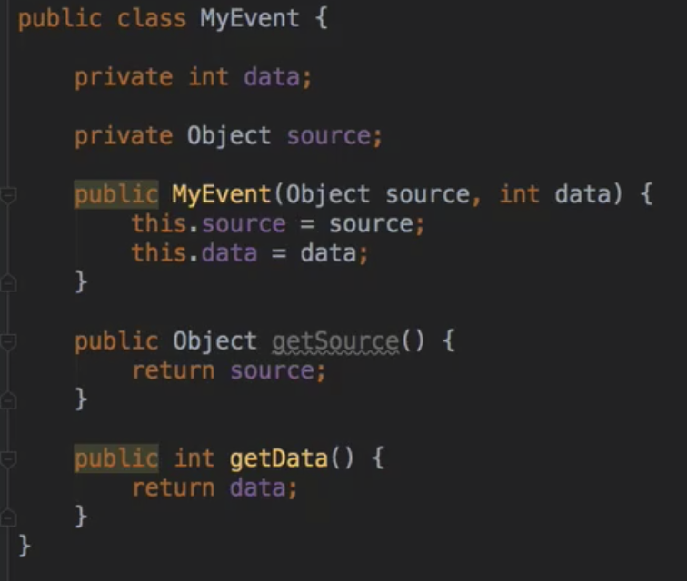
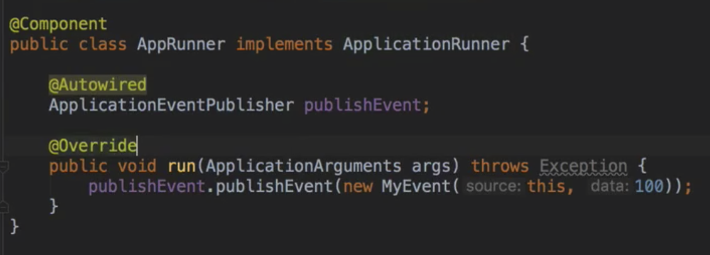

# 12/30 IoC Container

### Environment - 프로퍼티

- 프로퍼티
    - 다양한 방법으로 정의할 수 있는 설정값
    - Environment의 역할은 프로퍼티 소스 설정 및 프로퍼티 값 가져오기

```java
Environment environment = ctx.getEnvironment();
environment.getProperty("app.name"); //spring5 - Edit configuration에서 넣어준 값
```

- 프로퍼티를 읽을 때는 우선순위가 있다
    1. ServletConfig 매개변수
    2. SevletContext 매개변수
    3. JNDI
    4. JVM 시스템 프로퍼티 (-Dkey=”value”)
    5. JVM 시스템 환경 변수 (운영 체제 환경 변수)
- PropertySource
    - Environment를 통해 프로퍼티 추가하는 방법

### MessageSource

: 국제화 (I18n) 기능을 제공하는 인터페이스

```java
ApplicationContext extends MessageSource
getMessage(String code, Object[] args, String, default, Locale, loc)
```

스프링 부트를 사용한다면 별다른 설정 피룡없이 [messages.properties](http://messages.properties) 사용할 수 있음

- messages.properties
- messages_ko_kr.properties

Reloading 기능이 있는 메시지 소스 사용하기

```java
@Bean
public MessageSource messageSource() {
	var messageSource = new ReloadableResourceBundleMessageSource();
	messageSource.setBasename("classpath:/messages");
	messageSource.setDefaultEncoding("UTF-8");
	messageSource.setCacheSeconds(3); // 3초마다 다시 읽는다
	return messageSource;
}
//실시간으로 properties 파일을 변경하고 빌드하면 값이 변화한다
```

### ApplicationEventPublisher

이벤트 프로그래밍에 필요한 인터페이스 제공. Observer 패턴 구현체

```java
ApplicationContext extends ApplicationEventPublisher
publishEvent(ApplicationEvent event)
```

- 이벤트 만들기
    - ApplicationEvent 상속
    - 스프링 4.2부터 이 클래스를 상속받지 않아도 이벤트로 사용 가능



- 이벤트 발생시키는 방법
    - ApplicationEventPublisher.publishEvent()
      
        
    
- 이벤트 처리하는 방법
    - 기본적으로 synchronized
    - 순서를 정하고 싶다면 @Order와 함께 사용
    - 비동기적으로 실행하고 싶다면 @Async와 함께 사용
- 스프링이 제공하는 기본 이벤트
    - ContextRefreshedEvent: ApplicationContext를 초기화 했더나 리프래시 했을 때 발생.
    - ContextStartedEvent: ApplicationContext를 start()하여 라이프사이클 빈들이 시작
    신호를 받은 시점에 발생.
    - ContextStoppedEvent: ApplicationContext를 stop()하여 라이프사이클 빈들이 정지
    신호를 받은 시점에 발생.
    - ContextClosedEvent: ApplicationContext를 close()하여 싱글톤 빈 소멸되는 시점에
    발생.
    - RequestHandledEvent: HTTP 요청을 처리했을 때 발생. - filter와 interceptor 레이어 다음에 오는건가?? - 확인해볼것