# 1/10 RxJava - 조건과 불린 연산자

**all**

- 통지되는 모든 데이터가 설정한 조건에 맞는지 판단
- 결과값을 한번만 통지하면 되기 때문에 true/false 값을 Single로 반환한다
- 통지된 데이터가 조건에 맞지 않는다면 이후 데이터는 구독 해지되어 통지되지 않는다

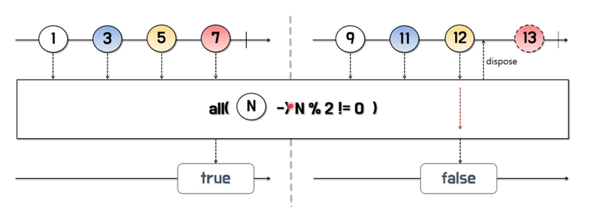

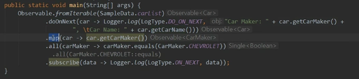

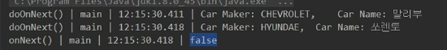

**amb**

- 여러개의 Observable 중에서 최초 통지 시점이 가장 빠른 Observable의 데이터만 통지되고, 나머지 Observable은 무시된다
    
    : 가장 먼저 통지를 시작한 Observable의 데이터만 통지
    

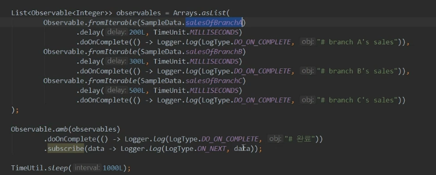

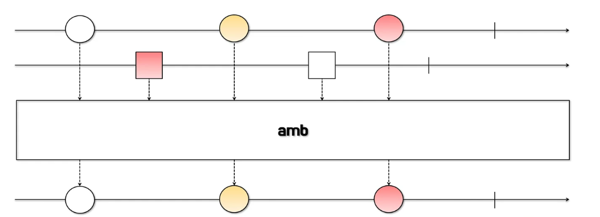

**contains**

- 파라미터의 데이터가 Observable에 포함되어 있는지를 판단한다.
- 결과값을 한번만 통지하면 되기 때문에 true/false 값을 Single로 반환한다.
- 결과 통지 시점은 Observable에 포함된 데이터를 통지하거나 완료를 통지할 때이다.

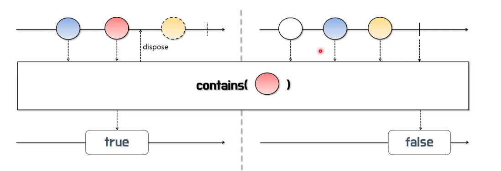

**defaultEmpty**

- 통지할 데이터가 없을 경우 파라미터로 입력된 값을 통지한다.
- 즉, 연산자 이름 의미 그대로 Observable에 통지할 데이터가 없이 비어있는 상태일 때 디폴트 값을 통지한다.

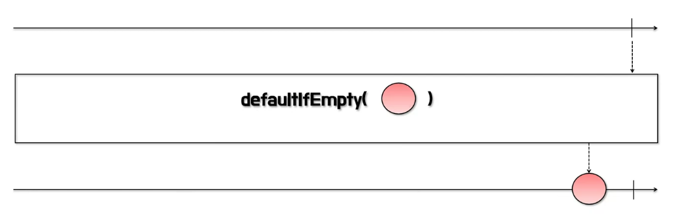

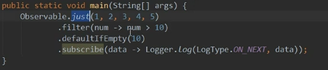

**sequenceEqual**

- 두 Observable이 동일한 순서로 동일한 갯수의 같은 데이터를 통지하는지 판단한다
- 통지 시점과 무관하게 데이터의 정합성만 판단하므로 통지 시점이 다르더라도 조건이 맞다면 true를 통지한다

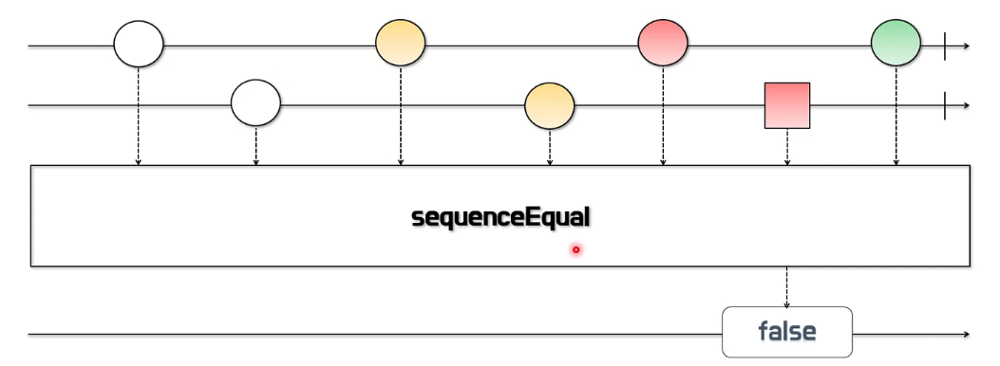

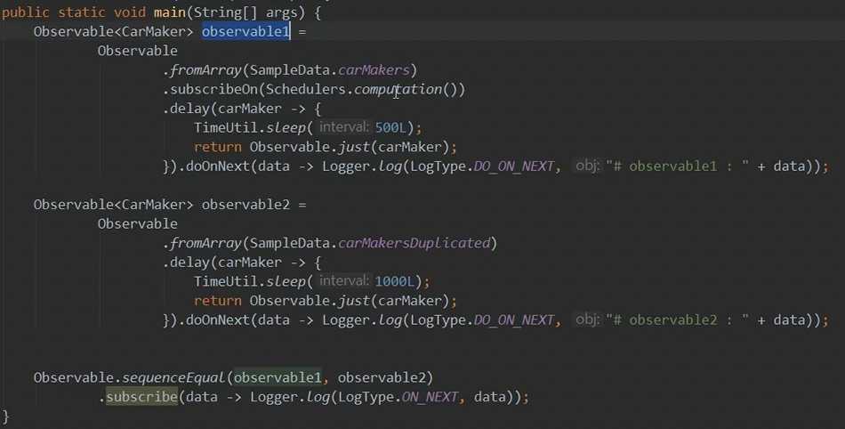

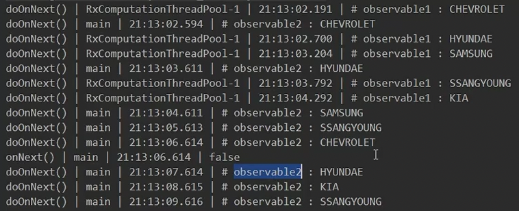