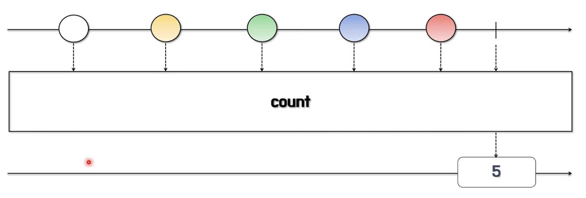
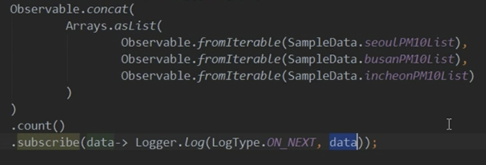
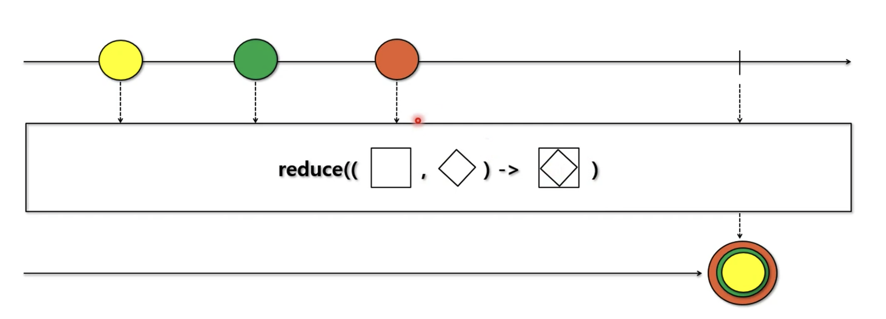
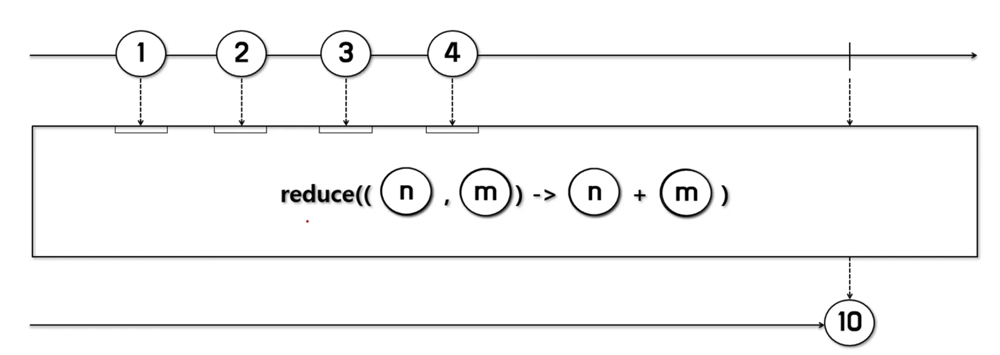
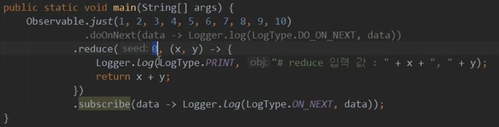

# 1/11 RxJava - 데이터 집계 연산자

**count**

- Observable이 통지한 데이터의 총 개수를 통지한다.
- 총 개수만 통지하면 되므로 결과값은 Single로 반환한다
- 데이터의 총 개수를 통지하는 시점은 완료 통지를 받은 시점이다

**reduce**

- Observable이 통지한 데이터를 이용해서 어떤 결과를 일정한 방식으로 합성한 후, 최종 결과를 반환한다.
- Observable이 통지한 데이터가 숫자일 경우 파라미터로 지정한 함수형 인터페이스에 정의된 계산 방식으로 값을 집계할 수 있다

** seed 라는 파라미터를 통해 첫 x에 들어갈 인자를 설정해 줄 수 있다