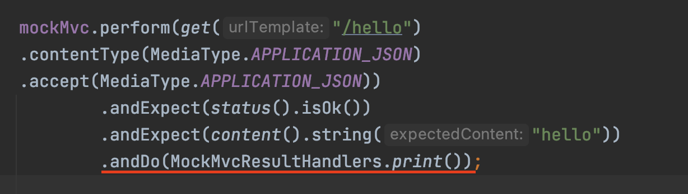
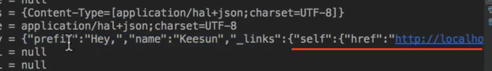
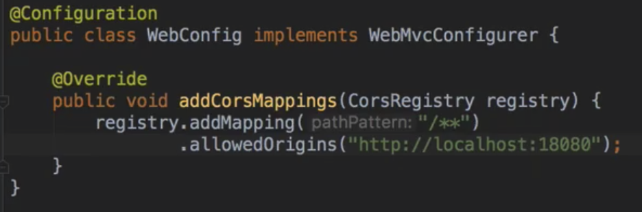

# 1/23 Spring Boot - Web MVC

** HTTP message 중 contentType은 보내는 request의 타입

** accept는 response의 타입을 명시해준다

** webjar를 이용하면 자바스크립트에서 사용하는 import 기능을 메이븐을 통해 받아올 수 있다

### Spring HATEOAS

Hypermedia As The Engine Of Application State

- 서버 : 현재 리소스와 연관된 링크 정보를 클라이언트에게 제공한다
- 클라이언트 : 연관 링크 정보를 바탕으로 리소스에 접근한다.
- 쉽게 말해 반환된 데이터의 연관된 링크정보를 함께 엮어서 보내준다

```java
//Hello 라는 객체를 반환하는 상황에서
Resource<Hello> helloResource = new Resource<>(hello); <- 위에서 생성된 hello 객체

helloREsource
			.add(linkTo(methodOn(sampleController.class).hello())
			.withSelfRel());

 return hello;
```

- response



** mockMvcTest시에 response 전체를 받아보는 방법



### CORS

- Origin : URI 스키마 - hostname + port
- Single Origin Policy : 하나의 오리진만 사용 가능하다는 규약
- Cross-Origin Resource Sharing : 하나의 오리진이 또 다른 오리진과 통신이 가능하게 해주는 방법
- 스프링 부트에서 사용하기 위해서는
    - 호출되는 컨트롤러 메소드에 @CrossOrigin(origins = “{anotherOrigin}”) 을 넣어준다
    - config에서 설정해준다

