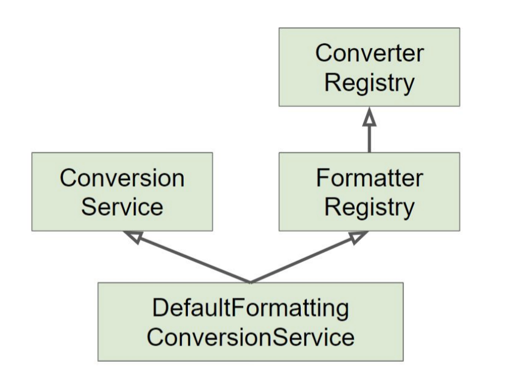

# 1/2 Spring - Data Binding

### 데이터 바인딩 추상화 : PropertyEditor

기술적인 관점 : 프로퍼티 값을 타겟 객체에 설정하는 기능

사용자 관점 : 사용자 입력값을 애플리케이션 도메인 모델에 동적으로 변환해 넣어주는 기능

- 입력값을 대부분 “문자열”인데, 그 값을 객체가 가지고 있는 int, long, Boolean, Data 등 심지어 Event, Book 같은 도메인 타입으로도 변환해서 넣어주는 기능.

PropertyEditor

- 스프링 3.0 이전까지 DataBinder가 변환 작업으로 사용하던 인터페이스
- 쓰레드-세이프 하지 않음 (상태 정보 저장하고 있음, 따라서 싱글톤 빈으로 등록해서 쓰다가는...)
- Object와 String 간의 변환만 할 수 있어, 사용범위가 제한적임

** Thread-Safe에 대해 복습하다가 HashMap의 경우 Thread-Safe를 기본적으로 채택하고 있다는 사실을 알게 되었다. 

** 현재 진행 중인 프로젝트에서 HashMap을 이용한 템플릿 패턴으로 제휴사 요청 서비스를 반환해주고 있는데 좋은 선택이었는지 의문이다. 굳이 쓰레드 세이프하게 구현할 필요는 없을 거 같은데.. 

```java
	public class EventPropertyEditor extends PropertyEditorSupport {
		@Override
		public String getAsText() {
		return ((Event)getValue()).getTitle();
	}
	@Override
	public void setAsText(String text) throws IllegalArgumentException {
		int id = Integer.parseInt(text);
		Event event = new Event();
		event.setId(id);
		setValue(event);
		}
}
```

### 데이터 바인딩 추상화 : Conveter, Formatter

**Converter**

- S 타입을 T 타입으로 변환할 수 있는 매우 일반적인 변환기
- 상태정보 없음 == Stateless == ThreadSafe - 빈으로 등록 가능
** Stateless : 상태가 없음 - 변수가 없는 객체를 일컬음
    
    
- ConvertRegistry에 등록해서 사용

```java
public class StringToEventConverter implements Converter<String, Event> {
	@Override
	public Event convert(String source) {
		Event event = new Event();
		event.setId(Integer.parseInt(source));
		return event;
	}
}
```

- 활용 가능성 : 특정 API에 리퀘스트가 특이할 때 컨버터 생성 후 Registry에 등록하여 변환해줄 수 있을 것 같다. 실무에서 특정 제휴사가 API정의서를 기존의 제휴사와 다르게 맞춰달라고 하여 Converter 클래스를 만들어서 REST 통신하는 부분에 일일이 할당해줬는데 Converter를 사용할 수 있었을 것 같다.

**Formatter**

- PropertyEditor 대체제
- Object와 String 간의 변환을 담당한다.
- 문자열을 Locale에 따라 다국화하는 기능도 제공한다. (optional)
- FormatterRegistry에 등록해서 사용

**ConversionService**

- 실제 변환 작업은 이 인터페이스를 통해서 Thread-Safe하게 사용할 수 있음
- 스프링 MVC, bean (value) 설정, SpEL에서 사용한다.
    - FormatterRegistry
    - ConversionService
    - 여러 기본 Converter와 Formatter를 등록해줌
        
        
        
- 스프링 부트
    - 웹 어플리케이션인 경우에 DefaultFormattingConversionService를 상속하여 만든 WevSonversionService를 빈으로 등록해준다.
    - Formatter와 Converter가 빈으로 등록되어 있는경우 자동으로 찾아 등록해준다.
    - ** Formatter를 WebMvcTest를 통해 테스트하고 싶은 경우 @WebMvcTest 어노테이션 파라미터에 넣어서 테스트해준다

### @WebMvcTest

Spring Slicing Test 중 하나로 컨트롤러를 테스트 하는 기능

- 특정 어노테이션을 가진 Bean만 스캔한다
- @Controller, @ControllerAdvice, @JsonComponent, @Converter, @GenericConverter, @Filter, @WebMvcConfigurer 그리고 @HandlerMethodArgumentResolver
- @Component는 지원하지 않음
- 테스트하고자 하는 Controller에 선언된 Service를 사용하고 싶은 경우

```java
@WebMvcTest(UserController.class)
public class UserControllerTest {

    @Autowired
    private UserController userController;

    @Autowired
    private MockMvc mockMvc;

    @MockBean
    private UserService userService;

    @Test
    public void getUserByIdTest() throws Exception {

        //mock the data return by the user service class
        User user = new User();

        user.setName("John");
        user.setEmail("John@devt.com");
        user.setPhone("965852262");
        user.setGender("Male");
				
				// Service가 수행할 동작을 이 부분에서 지정해준다
        when(userService.getUserById(anyInt())).thenReturn(user);
        //create a mock HTTP request to verify the expected result

        mockMvc.perform(MockMvcRequestBuilders.get("/user/12"))
                .andDo(print())
                .andExpect(MockMvcResultMatchers.jsonPath("$.name").value("John"))
                .andExpect(MockMvcResultMatchers.jsonPath("$.email").value("John@devt.com"))
                .andExpect(MockMvcResultMatchers.jsonPath("$.phone").value("965852262"))
                .andExpect(MockMvcResultMatchers.jsonPath("$.gender").value("Male"))
                .andExpect(status().isOk());

    }
```