# 1/4 RxJava - Operators 생성연산자

### RxJava Operators

- RxJava에서의 연산자는 메서드(함수)다
- 연산자를 이용하여 데이터를 생성하고 통지하는 Flowable이나 Observable 등의 생산자를 생성할 수 있다
- Flowable이나 Observable에서 통지한 데이터를 다양한 연산자를 사용하여 가공 처리하여 결과값을 만들어 낸다.
- 연산자의 특성에 따라 카테고리로 분류되며, 본 강의에서는 아래 분류에 속하는 연산자들을 살펴 볼 예정이다
    - Flowable/Observable 생성 연산자
    - 통지된 데이터를 필터링 해주는 연산자
    - 통지된 데이터를 변환해주는 연산자
    - 여러개의 Flowable/Observable을 결합하는 연산자
    - 에러 처리 연산자
    - 유틸리티 연산자
    - 조건과 불린 연산자
    - 통지된 데이터를 집계해주는 연산자

### interval

- 지정된 시간 간격마다 0부터 시작하는 숫자(Long)을 통지한다
- initialDelay 파라미터 이용해서 최초 통지에 대한 대기시간을 정할 수 있다
- 완료 없이 계속 통지한다
- 호출한 스레드와는 별도의 스레드에서 실행된다
- polling 용도의 작업을 수행할 때 활용할 수 있다

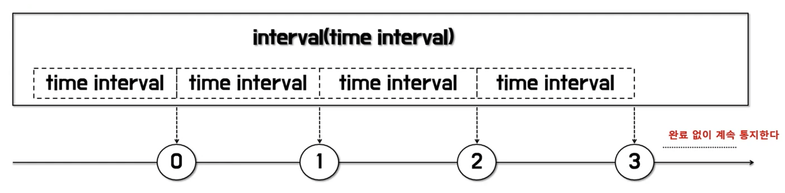

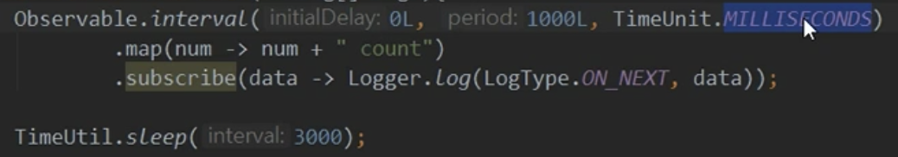

### range

- 지정한 값(n)부터 m개의 숫자(Integer)를 통지한다
- for, while문 등의 반복문을 대체할 수 있다

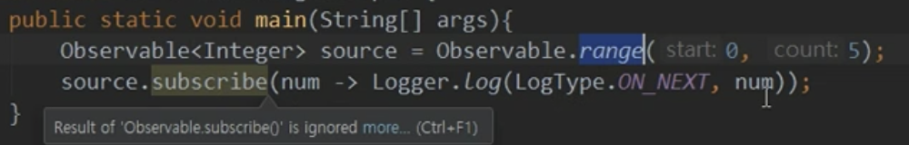

### timer

- 지정한 시간이 지나면 0(Long)을 통지한다
- 0을 통지하고 onComplete() 이벤트가 발생하여 종료한다
- 호출한 스레드와는 별도로 스레드에서 실행된다
- 특정 시간을 대기한 후에 어떤 처리를 하고자 할 때 활용할 수 있다

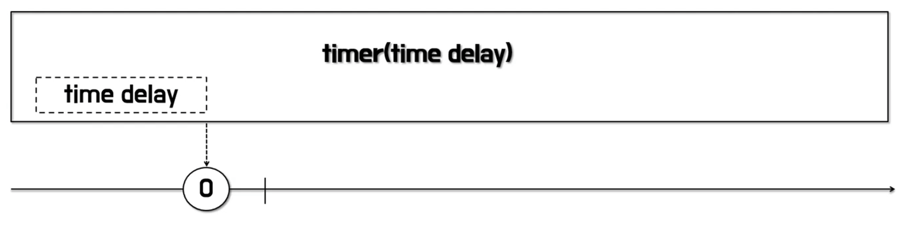

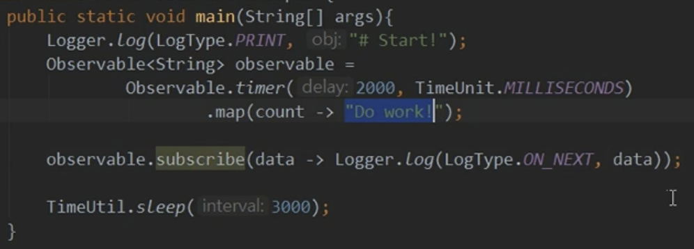

### defer

- 구독이 발생할 때마다 즉, subscribe()가 호출 될 때마다 새로운 Observable을 생성한다
- 선언한 시점의 데이터를 통지하는 것이 아니라 호출 시점의 데이터를 통지한다
- 데이터 생성을 미루는 효과가 있기 때문에 최신 데이터를 얻고자 할 때 활용할 수 있다

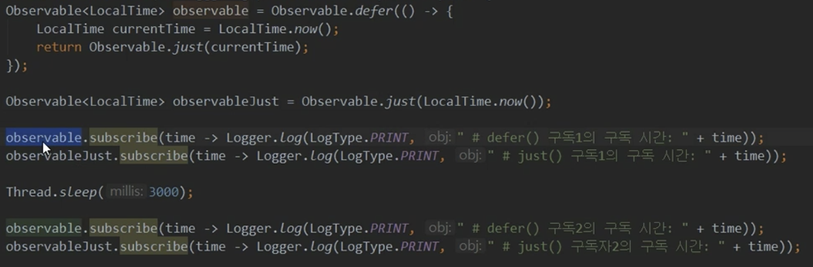

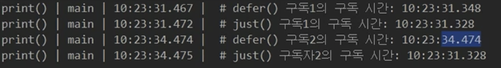

### fromIterable

- Iterable 인터페이스를 구현한 클래스를 파라미터로 받는다
- Iterable에 담긴 데이터를 순서대로 통지한다

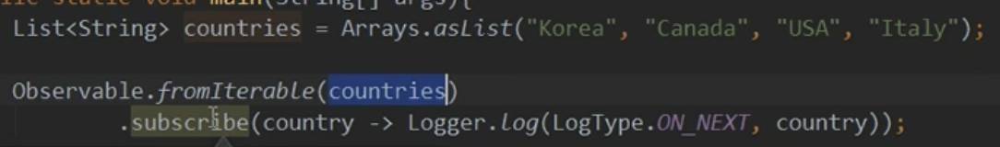

### fromFuture

- Future 인터페이스는 자바 5에서 비동기 처리를 위해 추가된 동시성 API이다
- 시간이 오래 걸리는 작업은 Future를 반환하는 ExecutorService에게 맡기고 비동기로 다른 작업을 수행할 수 있다
- Java 8에서는 CompletableFuture 클래스를 통해 구현이 간결해졌다

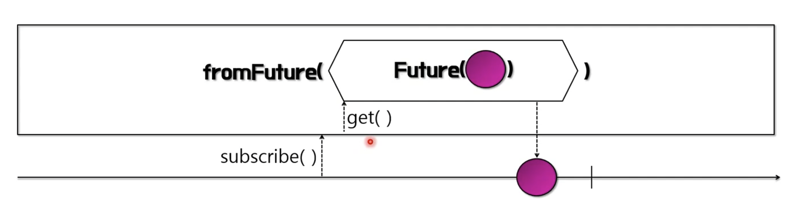

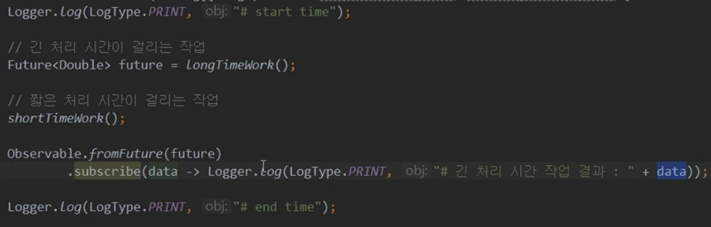

** Future에 대한 사용 예제 **

- Future를 사용하지 않은 경우

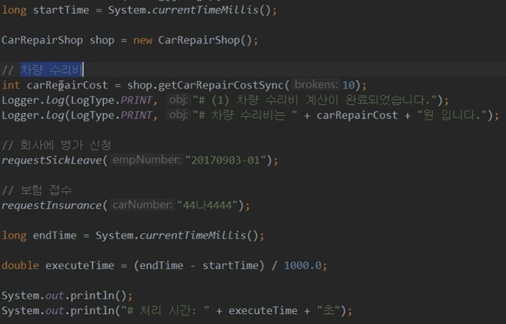

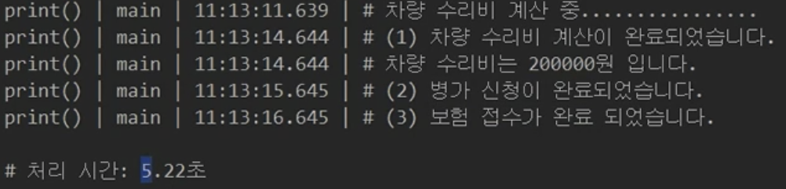

- Future를 사용한 경우

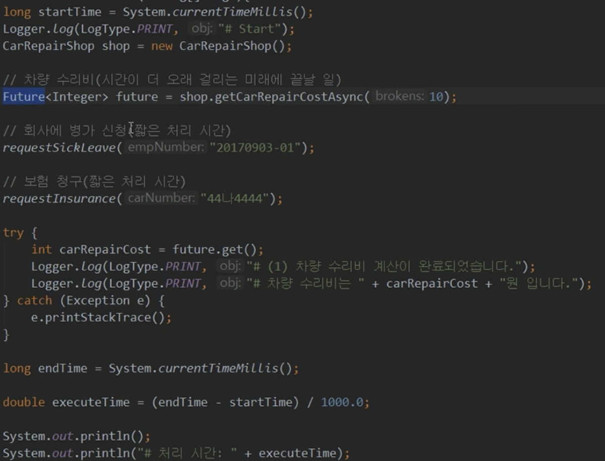

## 데이터 필터링 연산자

### filter

- 전달 받은 데이터가 조건에 맞는지 확인한 후, 결과가 true인 데이터만 통지한다.
- 파라미터로 받는 Prediacate 함수형 인터페이스에서 조건을 확인한다

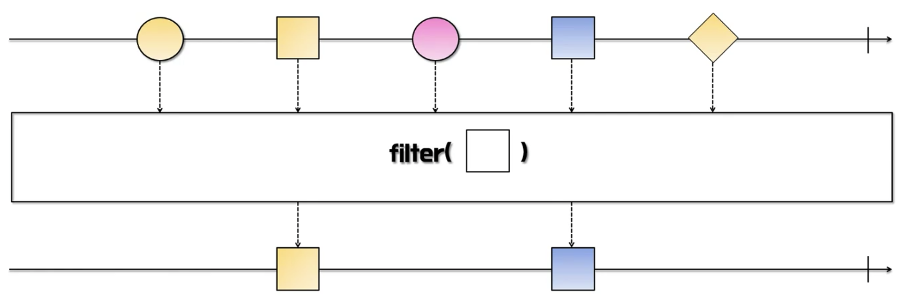

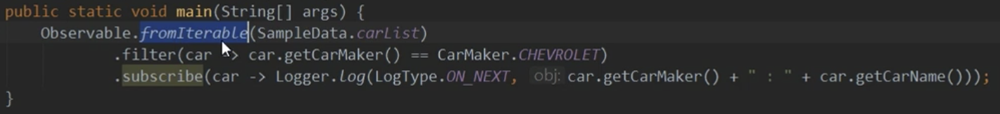

### distinct

- 이미 통지된 동일한 데이터가 있다면 이후의 동일한 데이터를 통지하지 않는다
- distinct의 사전적 의미는 ‘명확하게 구별되는’ 이라는 뜻을 포함한다

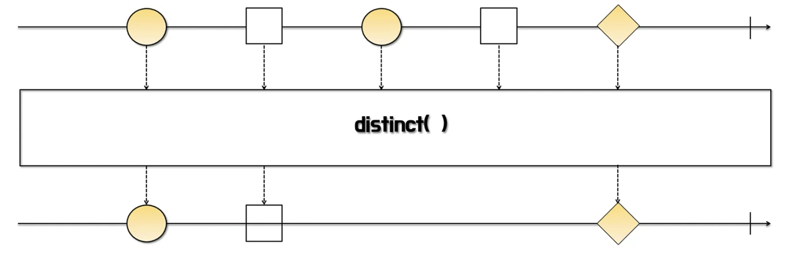

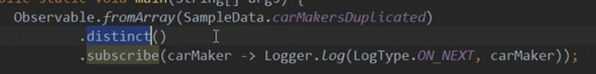

### take

- 파라미터로 지정한 개수나 기간이 될 때까지 데이터를 통지한다
- 지정한 범위보다 통지 데이터가 클 경우 데이터를 모두 통지하고 완료한다

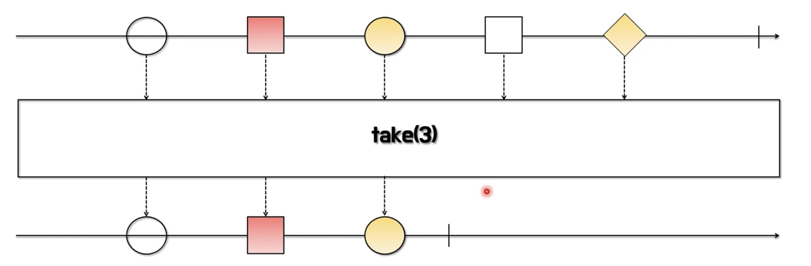

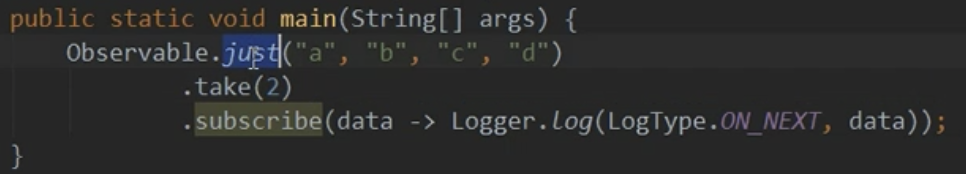

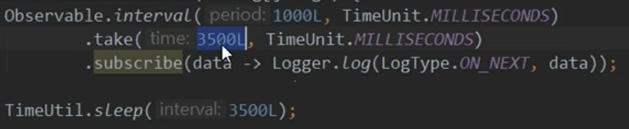

### takeUntil - 첫번째 유형

- 파라미터로 지정된 조건이 true가 될 때까지 데이터를 계속 통지한다

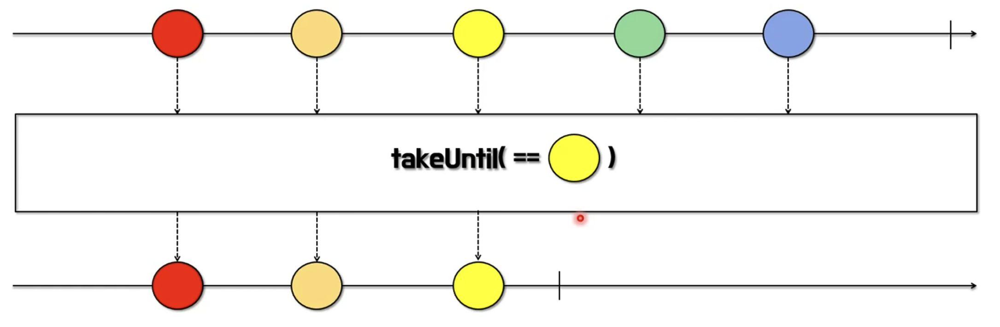

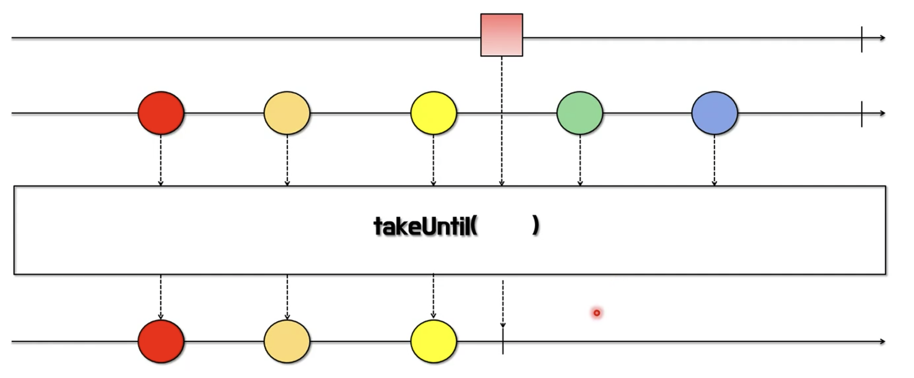

### takeUntil - 두번째 유형

- 파라미터로 들어온 Observable이 최초 데이터를 통지할 때까지 데이터를 계속 통지한다

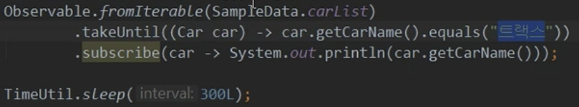

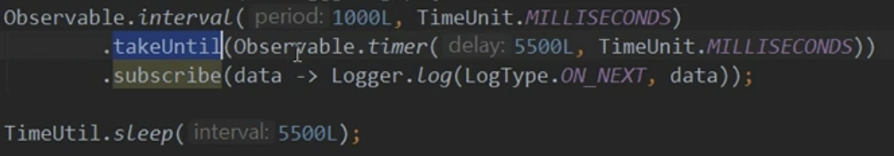

### skip

- 파라미터로 지정한 숫자만큼 데이터를 건너뛴 후 나머지 데이터를 통지한다

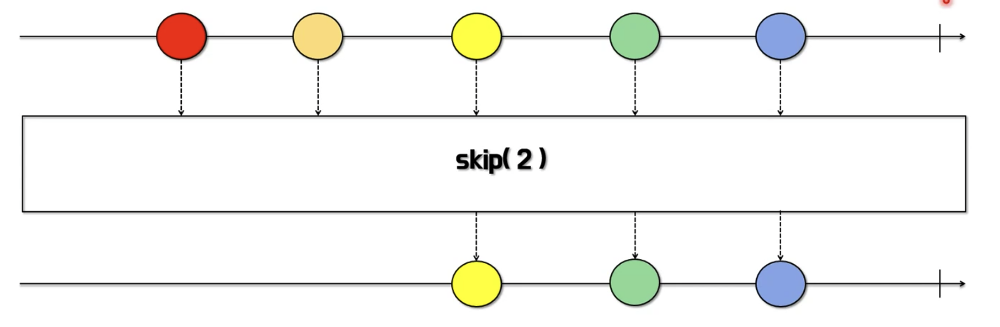

- 파라미터로 지정한 시간 만큼 데이터를 건너뛴 후 나머지 데이터를 통지한다

