# 1/9 RxJava Operators

### 유틸리티 연산자

**delay**

- 생산자가 데이터를 생성 및 통지를 하지만 설정한 시간만큼 소비자쪽으로의 데이터 전달을 지연시킨다.

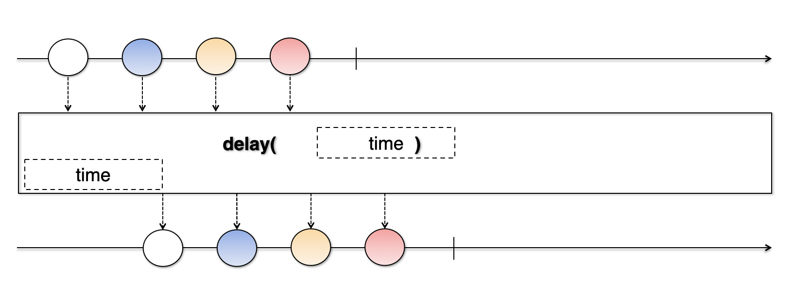

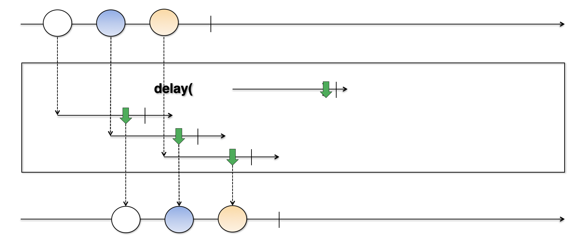

- 파라미터로 생성되는 Observable이 데이터를 통지할 때까지 각각의 원본 데이터의 통지를 지연시킨다.

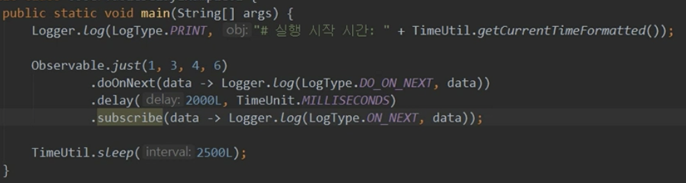

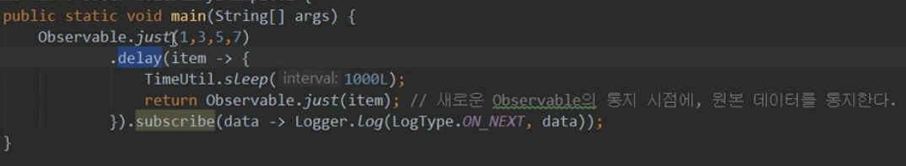

**delaySubscription**

- 생산자가 데이터의 생성 및 통지 자체를 설정한 시간만큼 지연시킨다
- 즉, 소비자가 구독을 해도 구독 시점 자체가 지연된다

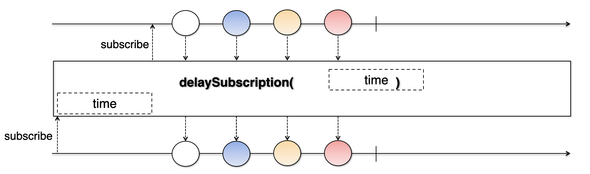

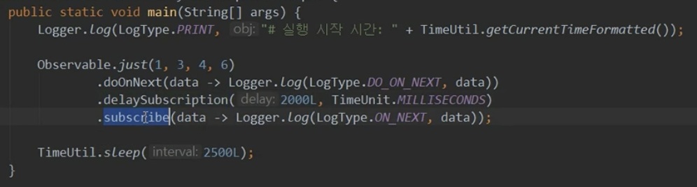

= 기존 delay 함수와 비교하여 로그를 확인해보았을 때 순서의 차이가 있다

**timeout**

- 각각의 데이터 통지 시, 지정된 시간안에 통지가 되지 않으면 에러를 통지한다
- 에러 통지시 전달되는 에러 객체는 TimeoutException이다

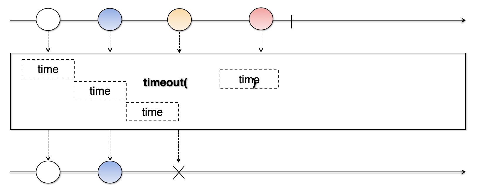

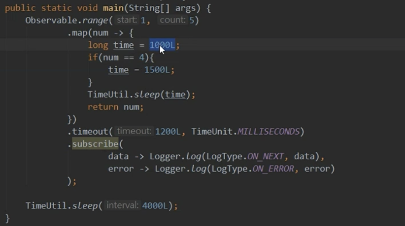

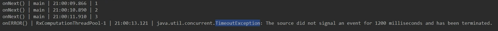

**timeInterval**

- 각각의 데이터가 통지되는데 걸린 시간을 통지한다.
- 통지된 데이터와 데이터가 통지되는 시간을 소비자쪽에서 모두 처리할 수 있다.

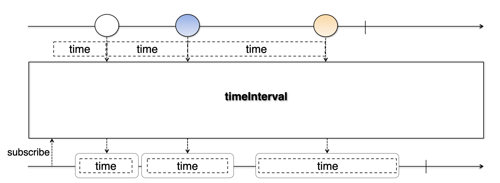

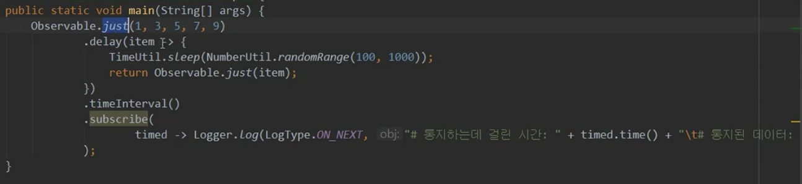

**materialize / dematerialize**

- materialize : 통지된 데이터와 통지된 데이터의 통지 타입 자체를 Notification 객체에 담고 이 Notification 객체를 통지한다. 즉, 통지 데이터의 메타 데이터를 포함해서 통지한다고 볼 수 있다.
- dematerialize : 통지된 Notification 객체를 원래의 통지 데이터로 변환해서 통지한다.

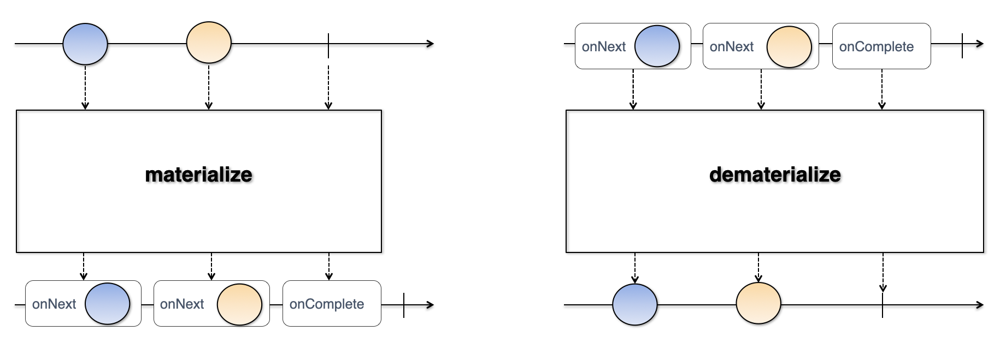