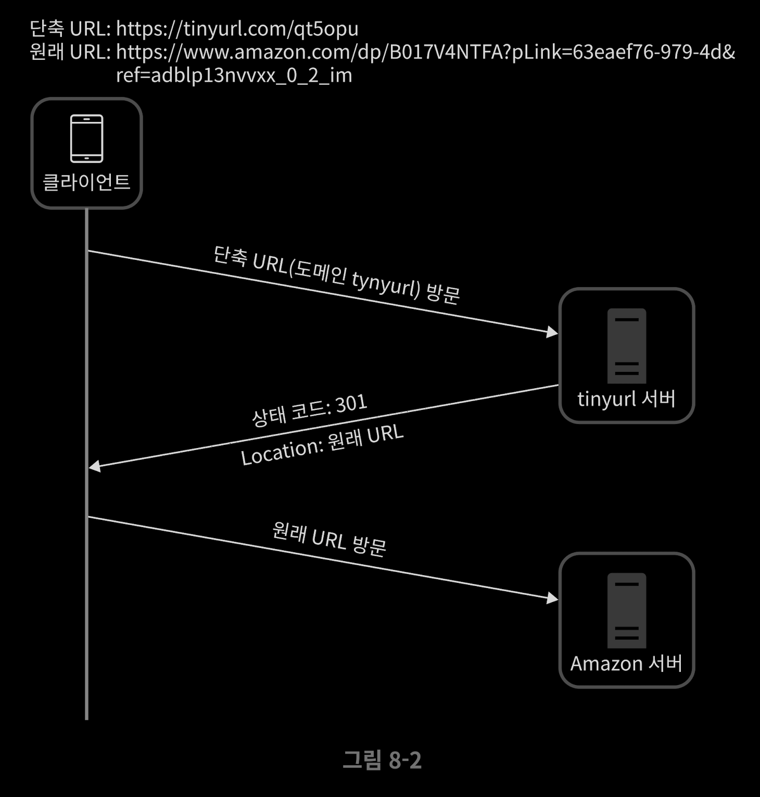
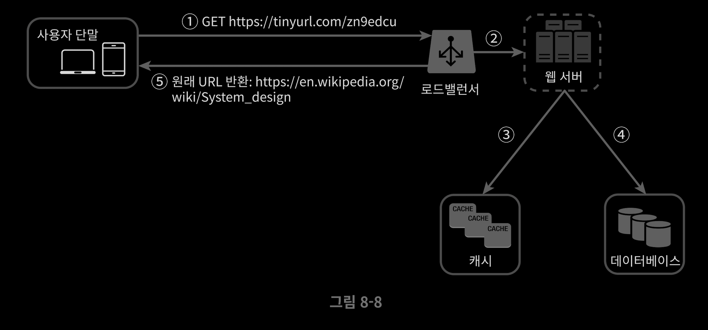

# 5/16 URL 단축기 설계

Date: May 16, 2022 5:24 AM

> 본 요약은 가상 [면접 사례로 보는 대규모 시스템 설계 기초](http://www.kyobobook.co.kr/product/detailViewKor.laf?mallGb=KOR&ejkGb=KOR&barcode=9788966263158) 에 대한 내용을 다루고 있습니다.
> 

### URL 단축기

: 기존에 존재하는 긴 url을 단축 url을 결과로 제공하는 것. 이 URL 접속시 원래 URL로 갈 수 있어야 함.

### API 엔드포인트

- URL 단축기는 기본적으로 두 개의 엔드포인트를 필요로 한다.
- URL 단축용 엔드포인트 : 단축한 URL를 인자로 실어 POST 요청을 보냄
- URL 리디렉션용 엔드포인트 : 단축 URd에 대해 HTTP 요청이 오면 원래 URL로 보내주기 위한 용도의 엔드포인트

### URL 리디렉션

- 단축 URL을 받은 서버는 그 URL을 원래 URL로 바꿔서 301응답의 Location 헤더에 넣어서 반환
- 통신 절차

- 301 Permanently Moved : 해당 URL에 대한 요청이 반환된 URL로 영구적으로 이전되었다는 응답으로 브라우져에서 캐시가 되어 추후 요청시 반환된 URL로 요청을 보내게 된다.
- 302 Found : 주어진 URL로의 요청이 ‘일시적으로' Location 헤더에 지정된 URL에 의해 처리되어야 한다는 응답. 항상 단축 URL서버로 먼저 요청을 보냄.

### URL 단축

- 중요한 것은 긴 URL을 해시 값으로 대응시킬 해시 함수이다.
- 요구사항
    - 긴 URL이 다른 값이면 해시값도 달라질 것
    - 원래 입력으로 주어졌던 긴 URL로 복원될 수 있어야 함

### 데이터 모델

- id, shortURL, longURL 이 세 개의 중요 컬럼을 가진 관계형 데이터 베이스에 저장하는 방법이 있다.

### URL 단축기 상세 설계

1. 입력으로 긴 URL을 받는다.
2. DB에 해당 URL이 있는지 검사한다.
3. DB에 해당 URL에 대한 단축 URL이 존재한다면 해당 단축 URL을 반환
4. 없는 경우 새로운 유일한 ID 생성
5. 62진법 변환을 적용, ID를 단축 URL로 만든다
6. ID, 단축 URL, 원래 URL로 새 DB 레코드를 만든 후 단축 URL을 클라이언트에 전달

 

### URL 리디렉션 상세 설계

1. 사용자가 단축 URL을 클릭
2. 로드밸런서가 해당 클릭으로 발생한 요청을 웹서버에 전달
3. 단축 URL이 캐시에 존재하는 경우 원래 URL을 바로 꺼내서 클라이언트에 전달
4. 캐시에 해당 단축 URL이 없는 경우 DB에서 꺼낸다. DB에 없다면 사용자가 잘못된 단축 URL을 입력한 경우
5. DB에서 꺼낸 URL을 캐시에 넣고 사용자에게 반환

