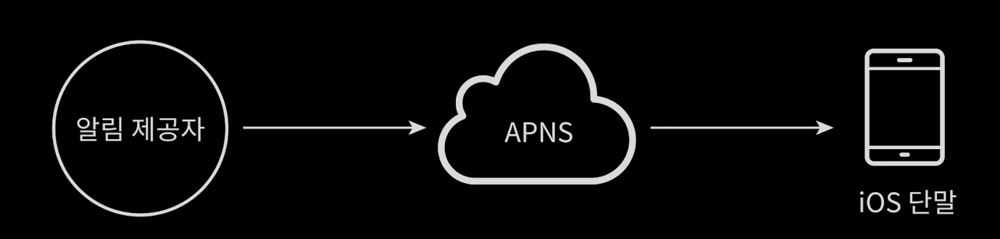

# 5/18 System Design - 알림 시스템 설계

Date: May 18, 2022 5:19 AM

> 본 요약은 가상 [면접 사례로 보는 대규모 시스템 설계 기초](http://www.kyobobook.co.kr/product/detailViewKor.laf?mallGb=KOR&ejkGb=KOR&barcode=9788966263158) 에 대한 내용을 다루고 있습니다.
> 

## 알림 시스템

: 최신 뉴스, 제품 업데이트, 이벤트, 선물 등 고객에게 중요한 정보를 비동기적으로 제공하며 모바일 푸시 알림, SMS, 이메일 이렇게 세가지로 분류할 수 있다.

- 요구사항
    - 푸시, SMS, 이메일 모두 지원할 것
    - soft real-time 시스템일 것 - 가능한 빨리 전달되어야 하지만 시스템에 부하가 있을 경우 약간 지연 가능
    - iOS, 안드로이드, PC 지원
    - 클라이언트 애플리케이션이나 서버 측에서 스케쥴링을 통해 알림 생성
    - 알림이 꺼진 사용자는 알림을 받지 않음
    - 하루 천만건 푸시, 백만 건 SMS, 5백만 건의 이메일 가능

### iOS 푸시 알림

- 알림 제공자
    - APNS로 알림 요청을 만드는 주체
    - 단말 토큰과 페이로드가 요청에 필요하다
    - 단말토큰 : 알림 요청을 위한 고유 식별자
    - 페이로드 : 알림 내용을 담은 JSON Dictionary
- APNS(Apple Push Notification Service)
    - 애플이 제공하는 원격 서비스로 푸시 알림을 iOS 장치로 보냄

### 안드로이드 푸시 알림

- iOS와 비슷하지만 APNS 대신 FCM(Firebase Cloud Messaging)을 사용한다.

### SMS 메세지

- 보통 Third-party 서비스를 많이 이용하며 사용 서비스이기 때문에 이용 요금을 내야 한다.

### 이메일

- 보통 상용 이메일 서비스를 이용한다.

### 연락처 정보 수집 절차

- 알림을 보내기 위해서는 모바일 단말 토큰, 전화번호, 이메일 주소 등의 정보가 필요하다.
- 앱을 설치하거나 계정 등록시 사용자의 정보를 수집하여 DB에 저장한다.

### 계략적 설계

- 1부터 N까지의 서비스
    - 각각 마이크로 서비스 일 수 있고 크론잡일 수도 있다.
    - 분산 시스템 컴포넌트일 수도 있다.
    - 과금서비스, 배송알림 등이 그 예이다
- 알림 시스템
    - 전송/수신 처리의 핵심으로 서비스에 알림 전송을 위한 API를 제공해야 하고 Third-party service에 전달한 페이로드를 만들어 낼 수 있어야 한다.
- 제3자 서비스(third party services)
    - 알림을 실제로 전달하는 역할
    - 확장성을 고려할 것
    - 지역마다 다른 Third-party service가 필요할 수 있다.
- 문제
    - SPOF - 알림 시스템이 하나이므로 장애시 서비스 전체의 장애로 이어짐
    - 규모의 확장성 : 한 대의 서비스로 처리하므로 DB나 캐시 등 중요 컴포넌트의 규모를 개별적으로 늘릴 수 없다.
    - 성능 병목

### 개선된 버전

- DB와 캐시를 알림 서비스의 주 서버에서 분리
- 알림 서버 증성, 자동으로 규모확장이 가능하도록 한다.
- 메시지 큐를 이용해 컴포넌트 사이의 강한 결합을 끊는다.
    - 다량의 알림 전송시 버퍼 역할도 한다.
    - 3자 서비스 중 하나에 장애가 발생해도 다른 종류의 알림은 정상 동작
- 프로세스
    1. API 호출하여 알림서버로 알림을 보냄
    2. 알림 서브는 사용자 정보, 단말 토큰, 알림 설정 같은 metadata를 캐시나 DB에서 가져온다.
    3. 알림 서버는 알림에 맞는 이벤트를 만들어 한 큐에 넣는다.
    4. 작업 서버는 메시지 큐에서 알림 이벤트를 꺼낸다
    5. 작업 서버는 알림을 제3자 서비스로 보낸다.
    6. 제 3자 서비스는 사용자 단말로 알림 전송

### 상세 설계

- 데이터 손실 방지
    - 알림이 손실 되면 안 되기 때문에 작업 서버에 DB를 유지하는 것이 한 가지 방법이다.
- 알림 중복 전송 방지
    - 분산 시스템 특성상 가끔은 알림이 중복되어 전송될 수 있다.
    - 보내야 할 알림이 도착하면 그 이벤트 ID를 검사하여 이전에 보낸 적 있는지 확인 할 것
- 알림 템플릿
    - 알림 메세지의 모든 부분을 처음부터 만들 필요 없도록 param, style, link만 조정하여 지정한 형식에 맞춰 알림을 만들어 내는 틀
- 알림 설정
    - 사용자의 알림 설정을 테이블에 보관하여 알림을 켜두었는지 확인
- 전송률 제한
    - 알림을 너무 많이 보내지 않도록 한 사용자가 받을 수 있는 알림 빈도를 제한
- 재시도 방법
    - 제3자 서비스가 알림 전송 실패시 재시도 전용 큐에 넣는다.