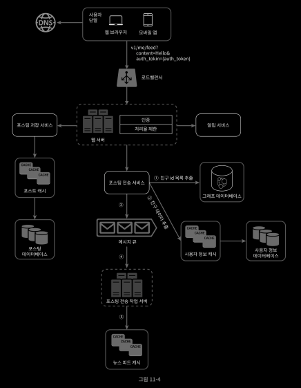
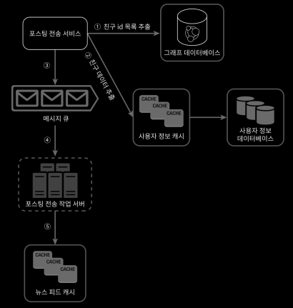

# 5/21 System Design - 뉴스 피드 시스템 설계

Date: May 21, 2022 9:52 AM

> 본 요약은 가상 [면접 사례로 보는 대규모 시스템 설계 기초](http://www.kyobobook.co.kr/product/detailViewKor.laf?mallGb=KOR&ejkGb=KOR&barcode=9788966263158) 에 대한 내용을 다루고 있습니다.
> 

## 뉴스 피드 시스템 설계

### 뉴스 피드란?

: 지속적으로 업데이트되는 스토리들로 사용자 상태 정보 업데이트, 사진, 비디오, 링크, 등등이 업데이트 된다. 비슷한 유형으로 페이스북과 인스타그램, 트위터 등이 있다.

### 요구사항

- 웹, 모바일 지원
- 중요기능 - 새로운 스토리 업로드, 친구들이 올리는 스토리 볼 수 있을 것
- 표시 순서 : 시간 흐름 역순
- 최대 친구 수는 5000명
- 트래픽 규모는 매일 천만명
- 이미지나 비디오가 미디어 파일로 포함될 수 있다.

### 주요 기능 설계

- 피드 발행 : 사용자가 스토리 포스팅 시 캐시와 DB에 기록 새 포스팅은 친구의 뉴스 피드에도 전송
- 뉴스 피드 생성 : 모든 친구의 포스팅을 시간 흐름 역순으로 만듬

### 피드 발행 상세 설계

- 웹서버
    - 인증이나 처리율 제한 기능도 수행한다.
    - Authorization 헤더가 있는 요청만 API를 호출하여 포스팅 가능하도록
    - 유해한 콘텐츠를 막기 위해 특정 기간 동안 한 사용자가 올릴 수 있는 포스팅의 수 제한
- 포스팅 전송(팬아웃) 서비스
    - 사용자의 새 포스팅은 친구 관계의 모든 사용자에게 전달하는 과정
    - 쓰기 시점 팬아웃, 읽기 시점 팬아웃이 존재한다.
    - 쓰기 시점 팬아웃(fanout-on-write, push model)
        - 포스팅 완료시 해당 사용자 캐시에 해당 포스팅 기록
        - 장점
            - 실시간으로 갱신되며 친구 목록에 있는 사용자에게 즉시 전송
            - 새 포스팅이 기록되는 순간에 피드가 이미 갱신되므로 피드를 읽는 데 드는 시간이 짧아짐
        - 단점
            - 친구가 많은 사용자의 경우 모든 피드를 갱신하는데 많은 시간 소요 - hotkey
            - 자주 이용하지 않는 사용자 피드까지 갱신해야 하므로 자원 낭비
    - 읽기 시점 팬아웃(fanout-on-read, pull model)
        - 피드를 일겅야 하는 시점에 갱신하는 요청 기반 모델
        - 장점
            - 비활성화된 사용자나 거의 사용하지 않는 사용자의 경우 유리함
            - 핫키 문제도 발생하지 않음
        - 단점
            - 피드를 읽는 데 많은 시간 소요될 수 있음
- 팬아웃 서비스 자세히 보기
    - 위의 두가지 팬아웃 서비스의 장점을 모두 취해보자
    
    
    
    1. 그래프 DB에서 친구 ID 목록을 가져옴
    2. 정보 캐시에서 친구들 정보를 가져옴 - 사용자 설정에 따라 친구를 걸러낼 수 있다.
    3. 친구 목록과 새 스토리 포스팅 ID를 메시지 큐에 넣는다
    4. 팬아웃 작업 서버가 메시지 큐에서 데이터를 꺼내어 뉴스 피드 데이터를 뉴스 피드를 뉴스피드 캐시에 넣는다.

### 피드 읽기 흐름 상세 설계

- 이미지나 비디오는 CDN에 저장하여 빨리 읽어갈 수 있도록 하였다.
- 읽기 순서
    1. 뉴스 피드 읽기 요청
    2. 로드 밸런서가 요청을 웹 서버 가운데 하나로 보냄
    3. 웹 서버는 피드를 가져오기 위해 뉴스 피드 서비스 호출
    4. 뉴스 피드 서비스는 뉴스 피드 캐시에서 포스팅 ID 목록 가져옴
    5. 뉴스 피드에 표시할 사용자 이름, 사진, 콘텐츠, 이미지 등을 사용자 캐시와 포스팅 캐시에 가져와 완전한 형태의 뉴스피드를 만듬
    6. 생성된 뉴스 피드를 JSON 형태로 클라이언트에게 보냄

### 마무리

- 설계안에 정답은 업ㅂㅅ다, 회사마다 제약이나 요구조건이 있기 때문
- 설계를 진행하고 기술을 선택할 때는 그 배경에 어떤 타협적 결정들이 있는지 잘 이해하고 설명할 수 있어야 한다.