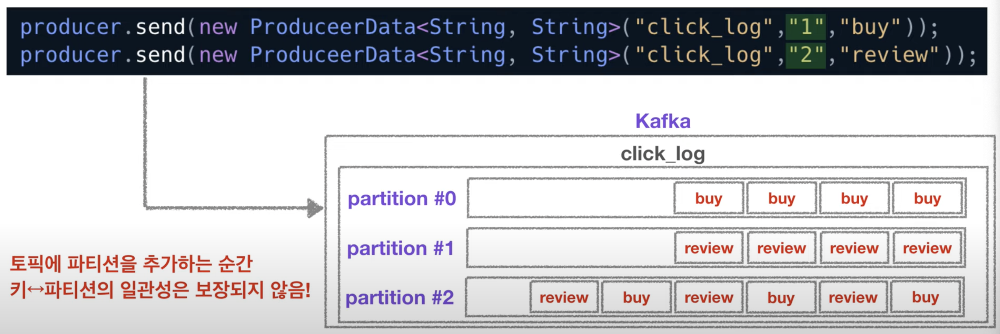

# 4/28 Apache Kafka

Date: April 28, 2022 5:22 AM

### Producer

- 카프카로 데이터를 적재하는 역할 - Topic에 생성
- 특정 Topic으로 데이터를 Publish
- 처리 실패/재시도
- 디펜던시로 가져와서 사용

```xml
<dependency>
	<groupId>org.apache.kafka</groupId>
	<artifactId>kafka-clients</artifactId>
	<version>2.3.0</version>
<dependency>
```

- 예시 코드

```java
public class Producer {
	public static void main(Stirng[] args) throws IOException {
	
	Properties configs = new Properties();
	configs.put("bootStrap.servers", "localhost:9092");
	// 2개 이상의 브로커 정보를 넣는 것을 추천 - 하나의 브로커에 장애가 생길 수 있으므로
  configs.put("key.serializer", "org.apache.kafka.common.serialization.StringSerializer");
	// Key는 토픽의 파티션을 지정해줄 때 쓰인다
	configs.put("value.serializer", "org.apache.kafka.common.serialization.StringSerializer");

	KafkaProducer<String, String> producer = new KafkaProducer<String, String> (configs);)
	
	ProducerRecord record = new ProducerRecord<String, String> ("click_log", "login");
	// 어느 토픽에 넣을지 결정
	producer.send(record);
	producer.close();
	}
}
```

- Key가 null이고 partition이 복수일경우 라운드 로빈으로 데이터를 적재한다.
- Key값에 따라서 파티션이 지정되어 데이터를 적재하며 파티션이 추가될 경우 일관성이 보장되진 않는다.



### Broker

- 카프카가 설치되어 있는 서버 단위
- 3개 이상의 브로커를 사용하는 것을 권장한다
- **Replication**
    - Replication 갯수에 따라 복제본의 갯수를 정한다
        
        ex) broker 갯수 3, replication 3 의 경우 1개의 leader partition과 2개의 follower partition으로 이뤄진다.
        
    - 브로커의 장애에 대비하는 장치이다.
- **Ack**
    - 0 : leader broker에 데이터를 전송하고 적재여부는 확인하지 않는다
    - 1 : leader broker에 데이터를 전송하고 적재여부를 확인한다
    - all : leader broker에 데이터를 전송하고 전재여부 확인 후 replicatition이 잘 이뤄졌는지까지 확인한다 - 속도 저하