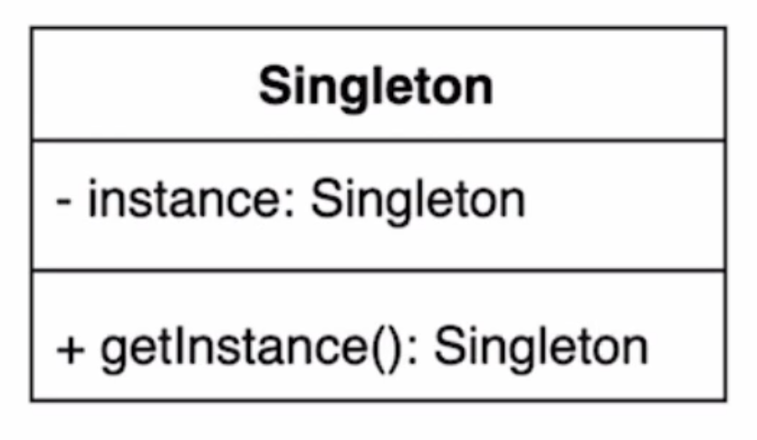

# 4/5 OOP - Design Pattern - Singleton

Date: April 5, 2022 6:01 AM

### 싱글톤 패턴



: 인스턴스를 오직 한개만 제공하는 클래스

- 시스템 런타임, 환경 세팅에 대한 정보 등, 인스턴스가 여러개 일 때 문제가 생길 수 있는 경우가 있다. 인스턴스를 오직 한개만 만들어 제공하는 클래스가 필요하다.
- new 를 사용하여 여러개의 인스턴스를 만들 수 없도록 구현해야 함
- 싱글톤 구현 방법

```java
public class Settings {

	private static Settings instance;
	private Settings(){}
	
	// 구현 방법 1
	public static Settings getInstance(){ // 이 방법은 멀티스레드에서 안전하지 않다. 
		if (instance == null) instance = new Settings; 
		// 하나의 쓰레드가 instance를 만들기 전에 다른 쓰레드가 if문에 접근하여 
		// 새로운 인스턴스를 만들 수 있다.
		return instance;
	}

	// 구현 방법 2 - synchronized 사용
	// 하나의 쓰레드만 사용할 수 있도록
	// 그러나 성능상 좋지 않다 
	public static synchronized Settings getInstance(){ // 이 방법은 멀티스레드에서 안전하지 않다. 
		if (instance == null) instance = new Settings; 
		return instance;
	}
}

// 구현방법 3 - 이른 초기화(eager initialization)
// 애플리케이션이 구동될 때 만들어지지만 만약 사용이 되지 않는다면 비용이 크다
public class Settings {
	private static final Setting INSTANCE = new Settings();
	private Settings(){}
	public static Setting getInstance(){
		return INSTANCE;
	}
}

// 구현방법 4 - double checked locking
// 코드가 복잡하고 하위 자바 버젼에서는 쓸 수 없다.
public class Settings{
	private static volatile Settings instance;
	private Setting(){}
	public static Settings getInstance(){
		if(instance == null){
			synchronized (Settings.class){
				if(instance == null){
					instance = new Settings();
				}
			}
		}
	}
}

// 구현방법 5 - static inner 클래스를 사용하는 방법
// 리플렉션을 사용할 경우 깨질 수 있다.
// 가장 무난한 방법
public class Settings{
	private Settings(){}
	private static class SettingsHolder{
		private static final Settings INSTANCE = new Settings();
	}
	public static Settings getInstance(){
		return SettingsHolder.INSTANCE;
	}
}

// 구현방법 6 - enum
// 리플렉션도 접근할 수 없다
// 상속을 사용할 수 없다
// 실행 초기에 생성된다
public Settings {
	INSTANCE;
}
```