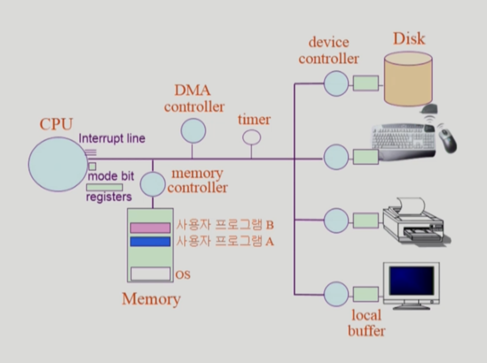

# 3/22 OS - System Structure

Date: March 22, 2022 6:00 AM

- Memory : CPU의 작업공간
    - CPU는 매 클럭 사이클마다 메모리에서 Instruction을 읽어 연산한다
- IO 장치들도 작은 CPU가 설치되어 Control된다
- Registers : CPU 안에 정보를 저장할 수 있는 공간
- Mode bit : CPU에서 실행되는 것이 운영체제인지 사용자 프로그램인지 확인해주는 것
- Interrupt line : CPU는 메모리에 있는 Instruction(기계어)만을 읽기 때문에
- device controller : CPU가 다른 장비에 일을 전담 시킨다.
    - Disk : Disk에 값을 읽어올 경우 device controller가 local buffer에서 값을 읽는 동안 CPU는 다른 일을 할 수 있다
- 만약 프로그램 A가 무한루프 도는 프로그램이라면?
    
    → timer라는 하드웨어가 특정 프로그램이 CPU를 독점하지 않도록 막아준다.
    
    → 운영체제가 다른 프로그램에 CPU를 넘겨줄 때 timer에 값을 넣어주면서 넘겨준다.
    
    → 오래 걸리는 경우 timer가 interrupt를 한다.
    
- 사용자 프로그램에서 IO가 필요한 경우 OS에게 CPU를 넘겨주면서 부탁한다.
- 기본적으로 interrupt가 들어오면 CPU의 주도권은 OS에게 넘어온다.
- DMA Controller - IO 장치의 너무 많은 interrupt로 인해 CPU의 효율이 떨어지므로 중간 중간에 들어오는 DMA Controller가 local buffer의 데이터를 Memory에 올려준다.

### Mode bit

- 사용자 프로그램의 잘못된 수행으로 다른 프로그램 및 운영체제에 피해가 가지 않도록 하기 위한 보호장치 필요
- Mode bit을 통해 하드웨어적으로 두 가지 모드의 operation 지원
    - 1 사용자모드 : 사용자 프로그램 수행
    - 0 모니터 모드(커널 모드, 시스템 모드) : OS 코드 수행
        - 보안을 해칠 수 있는 중요한 명령어는 모니터 모드에서만 수행 가능
        - Interrupt나 Exception 발생시 하드웨어가 mode bit을 0으로 바꿈
        - 사용자 프로그램에게 CPU를 넘기기 전에 mode bit을 1로 셋팅

### Timer

- 정해진 시간이 프른 뒤 운영체제에게 제어권이 넘어가도록 interrupt를 발생시킴
- 타이머는 매 클럭 틱 때마다 1씩 감소
- 타이머 값이 0이 되면 타이머 interrupt 발생
- CPU를 특정 프로그램이 독점하는 것으로부터 보호
- time sharing을 구현하기 위해 널리 이용됨
- 현재 시간을 계산하기 위해서도 사용

### Device Controller

- I/O device controller
    - 해당 I/O 장치유형을 관리하는 일종의 작은 CPU
    - 제어 정보를 위해 control register, status register를 가짐
    - local buffer를 가짐 (일종의 data register)
- I/O는 실제 device와 local buffer 사이에서 일어남
- Device controller는 I/O가 끝날을 경우 interrupt로 CPU에 그 사실을 알림
- 메모리도 하나의 디바이스이기 때문에 컨트롤러가 붙어있다.

** device driver : OS 코드 중 각 장치별 처리 루틴 → software

** device controller : 각 장치를 통제하는 일종의 작은 CPU → hardware

### 입출력(I/O)의 수행

- 모든 입출력 명령은 특권 명령
- 사용자 프로그램은 어떻게 I/O를 하는가?
    - 시스템 콜(System Call)
        - 사용자 프로그램은 운영체제에게 I/O 요청
    - trap을 사용하여 인터럽트 벡터의 특정 위치로 이동
    - 제어권이 인터럽트 벡터가 가리키는 인터럽트 서비스 루틴으로 이동
    - 올바른 I/O 요청인지 확인 후 I/O 수행
    - I/O 완료시 제어권을 시스템콜 다음 명령으로 옮김

### 인터럽트 (Interrupt)

: 인터럽트 당한 시점의 레지스터와 program counter를 save 한 후 CPU의 제어를 인터럽트 처리 루틴에 넘긴다.

- 넓은 의미의 인터럽트
    - Interrupt(하드웨어 인터럽트) : 하드웨어가 발생시킨 인터럽트
    - Trap (소프트 웨어 인터럽트)
        - Exception : 프로그램이 오류를 범한 경우
        - System Call : 프로그램이 커널 함수를 호출하는 경우
- 인터럽트 관련 용어
    - 인터럽트 벡터
        - 해당 인터럽트의 처리 루틴 주소를 가지고 있음
    - 인터럽트 처리 루틴
        - 해당 인터럽트를 처리하는 커널 함수

** 현대의 운영체제는 인터럽트에 의해 구동된다.

### 시스템 콜(System Call)

: 사용자 프로그램이 운영체제의 서비스를 받기 위해 커널 함수를 호출하는 것.