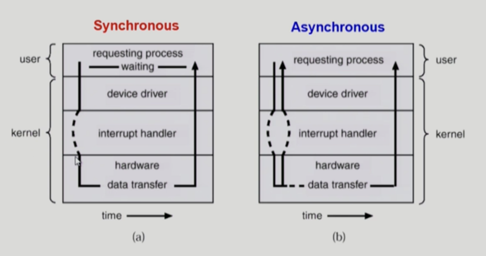
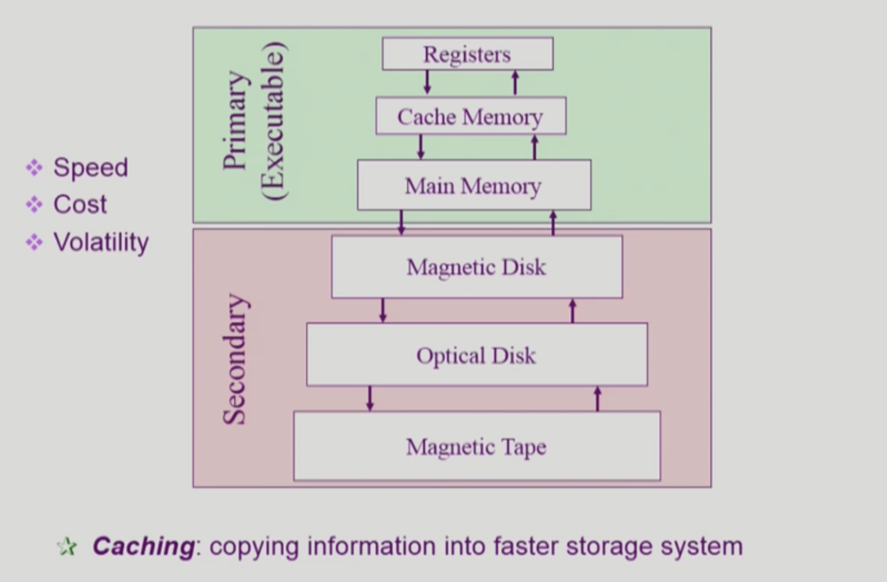
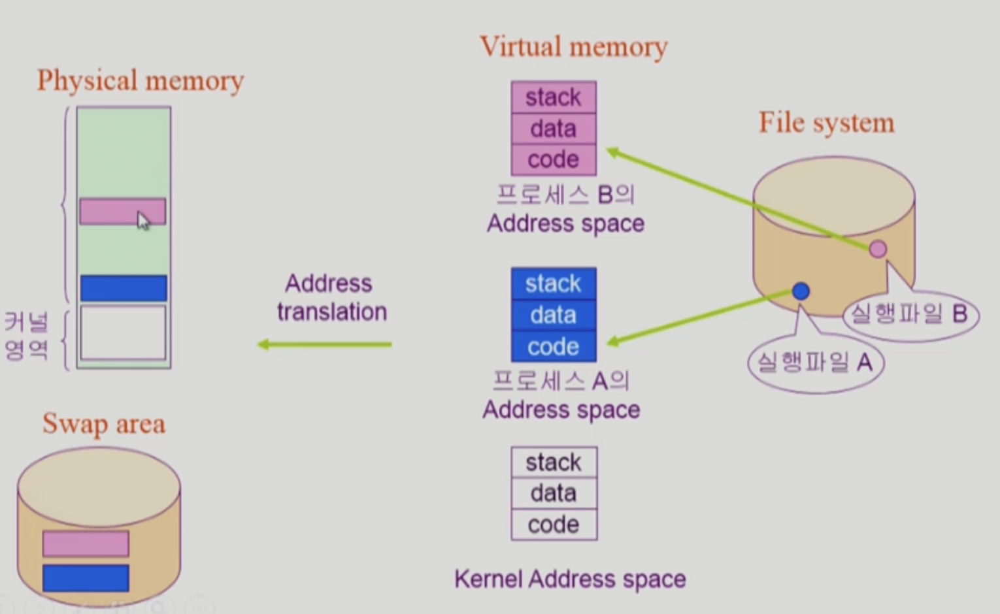
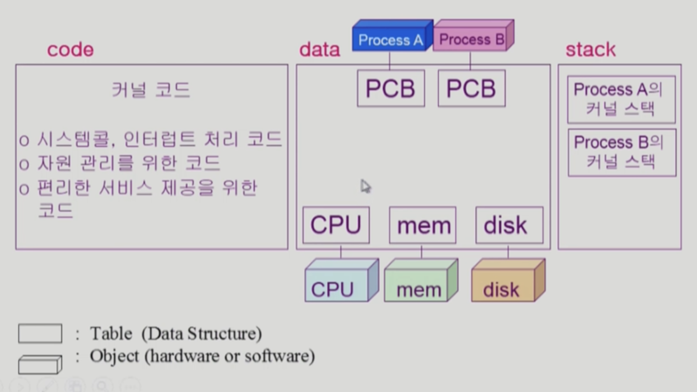
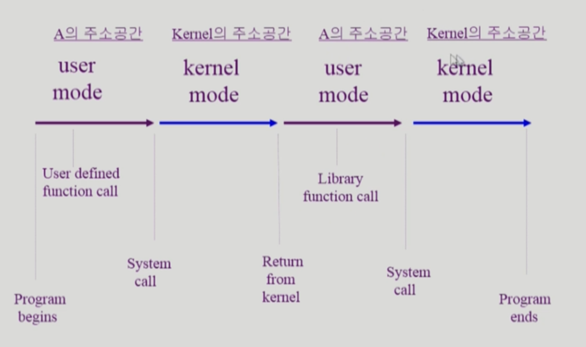

# 3/28 OS System Structure

Date: March 28, 2022 6:02 AM

- CPU는 프로그램 카운터라는 레지스터가 가르키는 메모리 주소에서 인스트럭션 읽어서 실행하는 일만 한다.
- 다음 인스트럭션을 읽기 전에 항상 interrupt line을 확인해서 interrupt가 존재하는 경우 OS에게 CPU권한이 넘어가 interrupt로 들어온 인스트럭션을 실행한다.

### 동기식 입출력과 비동기식 입출력

- 동기식 입출력 (Synchronous I/O)
    - I/O 요청 후 입출력 작업이 완료된 후에야 제어가 사용자 프로그램에 넘어감
    - 구현 방법 1
        - I/O가 끝날 때까지 CPU를 낭비시킴
        - 매시점 하나의 I/O만 일어날 수 있음
    - 구현 방법 2
        - I/O 처리가 완료될 때까지 해당 프로그램에게서 CPU를 빼앗음
        - I/O 처리를 기다리는 줄에 그 프로그램을 줄 세움
        - 다른 프로그램에게 CPU를 줌
- 비동기식 입출력 (Asynchronous I/O)
    - I/O가 시작된 후 입출력 작업이 끝나기를 기다리지 않고 제어가 사용자 프로그램에 즉시 넘어감

** 두 경우 모두 I/O 완료는 인터럽트로 알려줌

### DMA (Direct Memory Access)

- 빠른 입출력 장치를 메모리에 가까운 속도로 처리하기 위해 사용
- CPU의 중재 없이 device controller가 device의 buffer storage의 내용을 메모리에 block 단위로 직접 전송
- 바이트 단위가 아니라 block 단위로 인터럽트를 발생시킴

### 서로 다른 입출력 명령어

- I/O를 수행하는 special instruction에 의해
- Memory Mapped I/O에 의해

### 저장장치 계층 구조

- 밑에서 위에 데이터를 올려 놓는 것 - Caching

### 프로그램의 실행

: File System에서 프로그램을 실행할 경우 물리적 메모리로 바로 가는 것이 아니라 Virutal memory에 갔다가 물리 메모리로 이동한다.

### 커널 주소 공간의 내용

- PCB(Process Control Block) : 각 프로그램마다 운영체제에서 관리하고 있는 자료구조
- 함수 호출시 Stack 사용
- 프로세스마다 Stack을 따로 사용한다.

### 사용자 프로그램이 사용하는 함수

- 함수
    - 사용자 정의 함수 - Process A의 Address space
        - 자신의 프로그램에서 정의한 함수
    - 라이브러리 함수 - Process A의 Address space
        - 자신의 프로그램에서 정의하지 않고 갖다 쓴 함수
        - 자신의 프로그램의 실행 파일에 포함되어 있다
    - 커널 함수 - Kernel Address Space
        - 운영체제 프로그램의 함수
        - 커널 함수의 호출 = 시스템 콜

### 프로그램의 실행

