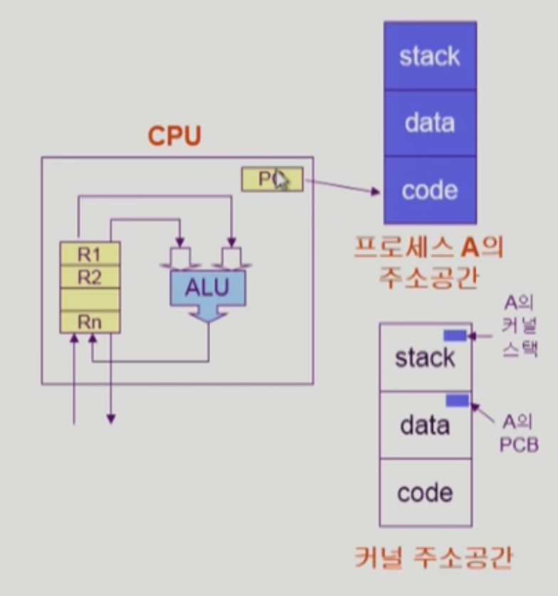
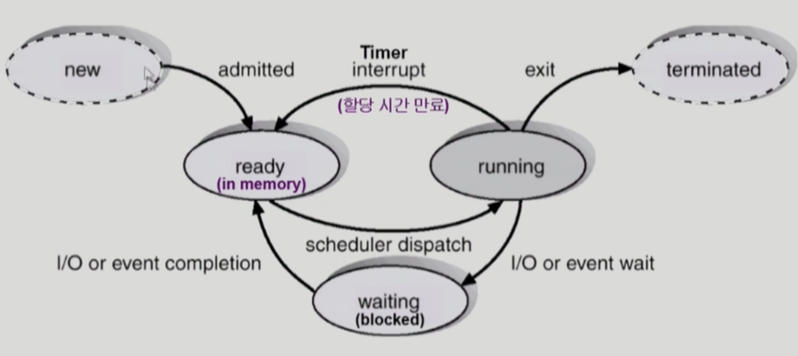

# 2/29 OS - Processor

Date: March 29, 2022 6:32 AM

### 프로세스의 개념

- “Process is **a program in execution**”
- 프로세스의 Context
    - CPU 수행 상태를 나타내는 하드웨어 Context
        - Program Counter
            
            : 프로세스의 code가 존재하는 곳의 주소값을 가지고 있다.
            
        - 각종 register
            
            : code에서 가져온 인스트럭션을 저장한다.
            
    - 프로세스의 주소 공간
        - code, data, stack
    - 프로세스 관련 커널 자료 구조
        - PCB(Process Control Block)
        - Kernel stack
    
    : 멀티태스킹에 의해 여러 프로세스를 CPU에 할당하는 경우 Context의 중요성이 커진다
    

### 프로세스의 상태

- 프로세스는 상태가 변경되며 수행된다
    - Running
        
        : CPU를 잡고 instruction을 수행중인 상태
        
    - Ready
        
        : CPU를 기다리는 상태(메모리 등 다른 조건을 모두 만족하고)
        
    - Blocked (wait, sleep)
        - CPU를 주어도 instruction을 수행할 수 없는 상태
        - Process 자신이 요청한 event(예: I/O)가 즉시 만족되지 않아 이를 기다리는 상태
    - New: 프로세스가 생성중인 상태
    - Terminated: 수행이 끝난 상태

