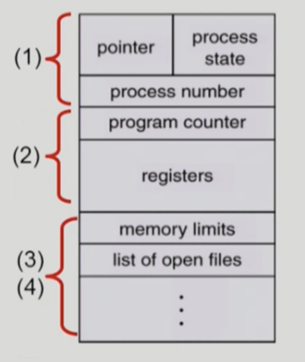
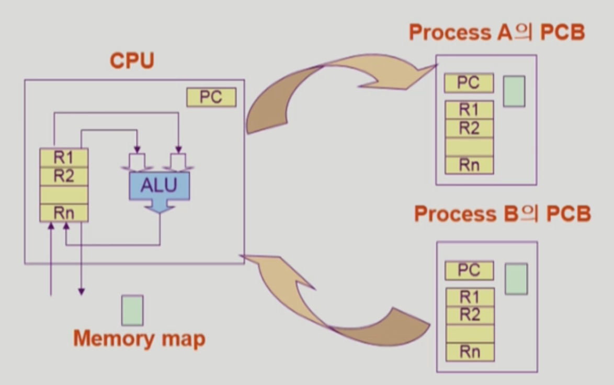
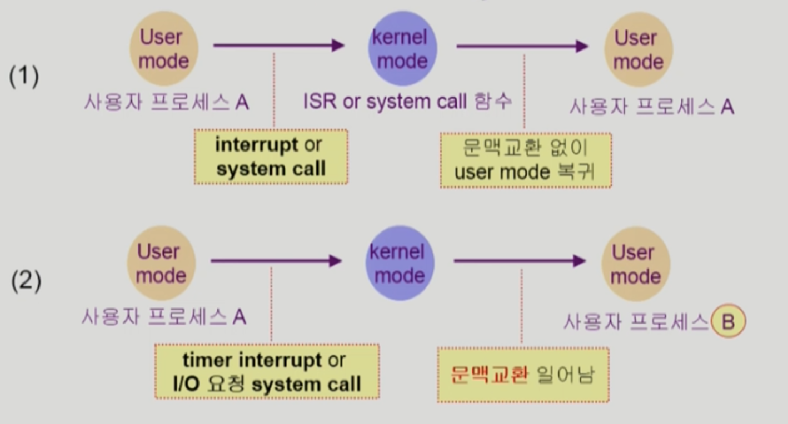
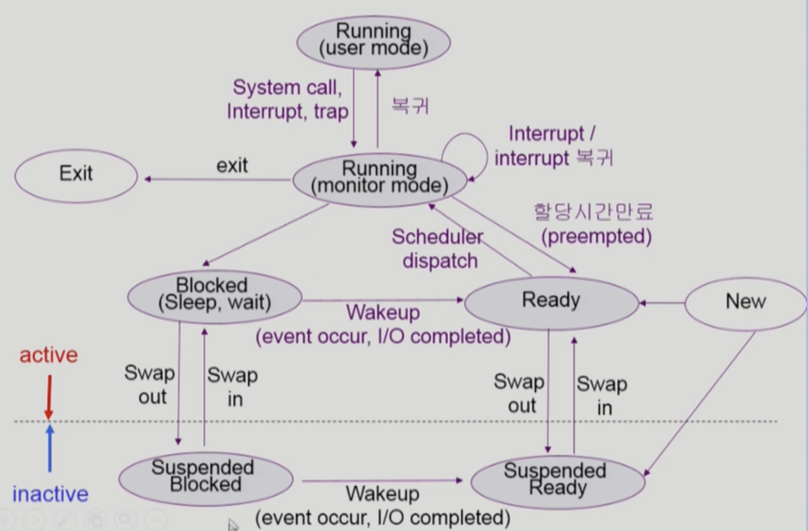

# 3/30 OS - Process

Date: March 30, 2022 5:48 AM

### Process Control Block (PCB)

- 운영체제가 각 프로세스를 관리하기 위해 프로세스당 유지하는 정보
- 다음의 구성 요소를 가진다 (구조체로 유지)
    1. OS가 관리상 사용하는 정보
        - Process state(READY, RUNNING ...), Process ID (고유번호)
        - scheduling information, priority(CPU를 주기 위한 우선순위)
    2. CPU 수행 관련 하드웨어 값
        - Program counter, register(Context 관련 정보)
    3. 메모리 관련
        - Code, data, stack의 위치 정보
    4. 파일 관련
        - Open file descriptors...

### 문맥 교환 (Context Switch)

- CPU를 한 (사용자)프로세스에서 다른 (사용자)프로세스로 넘겨주는 과정
- CPU가 다른 프로세스에게 넘어갈 때 운영체제는 다음을 수행
    - CPU를 내어주는 프로세스의 상태를 그 프로세스의 PCB에 저장
    - CPU를 새롭게 얻는 프로세스의 상태를 PCB에서 읽어옴
- System Call 이나 Interrupt 발생시 반드시 Context Switch가 일어나는 것은 아님
    
    
    

** (1)의 경우에도 CPU 수행 정보 등 context의 일부를 PCB에 save 해야 하지만 문맥교환을 하는 (2)의 경우 그 부담이 훨씬 큼(eg. cache memory flush)

### 프로세스를 스케쥴링 하기 위한 큐

- Job queue : 현재 시스템 내에 있는 모든 프로세스의 집합
- Ready queue : 현재 메모리 내에 있으면서 CPU를 잡아서 실행되기를 기다리는 프로세스의 집합
- Device queues : I/O device의 처리를 기다리는 프로세스의 집합

** 프로세스들은 각 큐들을 오가며 수행된다.

### 스케쥴러 (Scheduler)

- Long-term scheduler (장기 스케쥴러 or job scheduler)
    - 시작 프로세스 중 어떤 것들을 ready queue로 보낼지 결정
    - 프로세스에 memory(및 각종 자원)을 주는 문제
    - degree of Multiprogramming을 제어 - 메모리에 올라가 있는 프로세스의 수를 조절
    - time sharing system(보통 우리가 사용하는 시스템)에는 보통 장기 스케쥴러가 없음 (무조건 ready)
- Short-term scheduler (단기 스케쥴러 or CPU scheduler)
    - 어떤 프로세스를 다음번에 running 시킬지 결정
    - 프로세스에 CPU를 주는 문제
    - 충분히 빨라야 함 (millisecond 단위)
- Medium-term scheduler (중기 스케쥴러 or Swapper)
    - 여유 공간 마련을 위해 프로세스를 통째로 메모리에서 디스크로 쫓아냄(너무 많이 memory에 올라가 있는 경우 프로세스 수를 줄인다)
    - 프로세스에게서 memory를 뺏는 문제
    - 프로세스의 상태를 suspended 상태로 변경
        - 프로세스를 통째로 디스크 Swap out 시킨다
    - degree of Multiprogramming을 제어

### 프로세스 상태도

