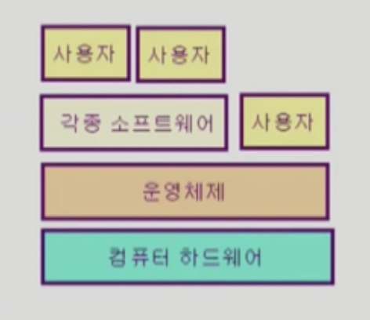
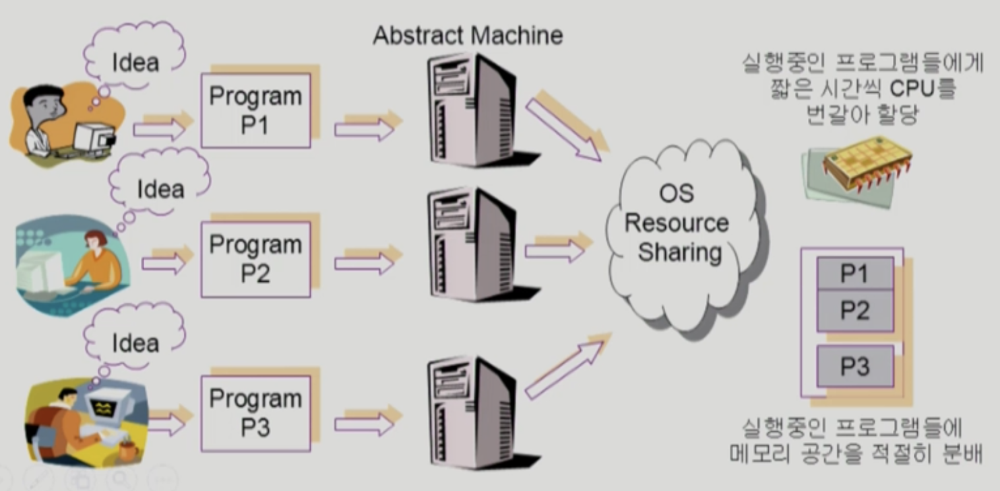
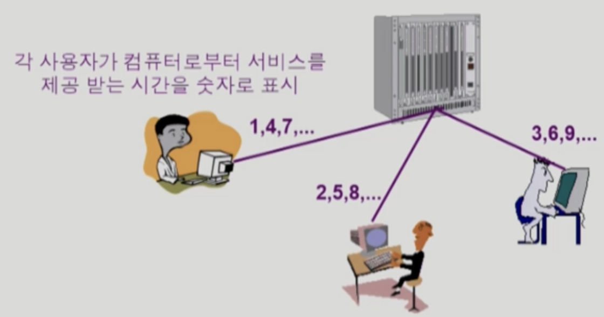

# 3/7 OS - Introduction

Date: March 7, 2022 6:09 AM

### 운영 체제란?

- **컴퓨터 하드웨어 바로 위에 설치**되어 사용자 및 다른 모든 소프트웨어와 하드웨어를 연결하는 소프트웨어 계층
    
    
    
- 좁은 의미의 운영체제 (커널)
    
    : **운영체제 핵심 부분으로 메모리에 항상 상주**하는 부분
    
- 넓은 의미의 운영체제
    
    : 커널 뿐 아니라 각종 주변 시스템 유틸리티를 포함한 개념
    

### 운영 체제의 목적

- 컴퓨터 시스템의 **자원을 효율적으로 관리**
    - 프로세서, 기억장치, 입출력 장치 등의 효율적 관리
        - 사용자간의 형평성 있는 자원 분배
        - 주어진 자원으로 최대한의 성능을 내도록
    - 사용자 및 운영체제 자신의 보호
    - 프로세스, 파일, 메시지 등을 관리
- 컴퓨터 시스템을 편리하게 용할 수 있는 환경을 제공
    - 운영체제는 동시 사용자/프로그램들이 각각 독자적 컴퓨터에서 수행되는 것 같은 환상을 제공
    - 하드웨어를 직접 다루는 복잡한 부분을 운영체제가 대행

### 운영체제의 분류

- 동시 작업 가능 여부
    - 단일 작업
        - 한번에 하나의 작업만 처리
        - e.g) MS-DOS 프롬프트 상에서는 한 명령의 수행을 끝내기 전에 다른 명령을 수행시킬 수 없음
    - 다중 작업
        - 동시에 두 개 이상의 작업 처리
        - e.g) UNIX, MS Windows 등에서는 한 명령의 수행이 끝나기 전에 다른 명령이나 프로그램을 수행할 수 있음
- 사용자의 수
    - 단일 사용자
        - MS-DOS, MS Windows(현재는 다중 사용자도 가능하다)
    - 다중 사용자
        - UNIX, NT server
- 처리 방식
    - 일괄 처리 (batch processing) - 현대에는 찾아보기 힘들다 / 역사 속의 시스템..
        - 작업 요청의 일정량 모아서 한꺼번에 처리
        - 작업이 완전 종료될 때까지 기다려야 함 (초기 Punch Card 처리 시스템)
    - 시분할 (time sharing) - 현대에 존재하는 처리방식
        
        
        
        - 여러 작업을 수행할 때 컴퓨터 처리 능력을 일정한 시간 단위로 분할하여 사용
        - 일관 처리 시스템에 비해 짧은 응답 시간을 가짐 - UNIX
        - interactive한 방식
    - 실시간(Realtime OS) - 아주 정교한 시스템
        - 정해진 시간 안에 어떠한 일이 반드시 종료됨이 보장되어야 하는 실시간 시스템을 위한 OS
            - 원자로/공장 제어, 미사일 제어, 반도체 장비, 로보트 제어
        - 실시간 시스템의 개념 확장
            - Hard realtime system
            - Soft realtime system