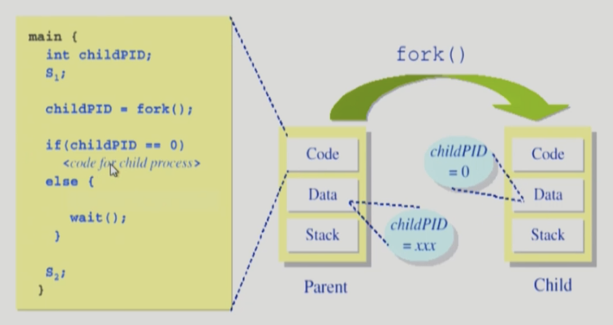

# 4/8 OS - Process Management

Date: April 8, 2022 6:07 AM

- 프로세스 복제란 프로세스의 Context는 복제하는 것
- Copy-on-write (COW) : write가 발생했을 때 Copy를 하는 것 (부모 프로세스에 비해 자식 프로세스의 독립적인 태스크가 실행되었을 때)
- 새로운 프로세스를 생성하는 시스템콜 : fork()

### Fork() 시스템콜

: A process is created by the `fork()` system call.

- creates a new address apace that is a duplicate of the caller.

```c
int main()
{
	int pid;
	pid = fork();
	if(pid == 0) // this is child <- fork()이후 child process의 시작 위치
	else if(pid > 0) // this is parent
}
```

- fork() 실행시 동일한 코드가 복제된다 - 자식 프로세스
- fork() 실행시 자식 프로세스는 부모 프로세스의 context를 복제하기 때문에 fork() 이후부터 코드를 실행한다

### exec() 시스템콜

: 완전히 새로운 프로세스로 태어나게 해주는 함수

: A process can execute a different program by the `exec()` system call.

- replaces the memory image of the caller with a new program

```c
int main()
{
	int pid;
	pid = fork();
	if(pid == 0) {
		execlp("/bin/date", "/bin/date", (char *)0);
	}
	else if(pid > 0) // this is parent
}
```

- execlp(실행할 프로그램, 실행할 프로그램을 위한 argument) - Linux
- exec을 하는 경우 다시 돌아올 수 없다.
- 꼭 자식 프로세스만을 위한 것은 아니다.
- 기존 main에서 exec을 실행하는 경우 새로운 프로그램으로 덮어쓰기 하기 때문에 이후의 코드는 실행되지 않는다.

```c
int main(){
	printf("1"); // 1
	execlp("echo", "echo", "3", (char *)0); // 3
	print("2"); // 실행되지 않음
}
```

### wait() 시스템콜



- 프로세스 A가 wait() 시스템 콜을 호출하면
    - 커널은 child가 종료될 때까지 프로세스 A를 sleep 시킨다 (block 상태)
    - Child process가 종료되면 커널은 프로세스 A를 깨운다 (ready 상태)
- 리눅스에서 프롬프트에 명령어를 입력할 경우 → 자식프로세스 생성 (기존 프로세스는 wait())

### exit() 시스템콜

: 프로세스의 종료

- 자발적 종료
    - 마지막 statement 수행 후 exit() 시스템 콜을 통해
    - 프로그램에 명시적으로 적어주지 않아도 main 함수가 리턴되는 위치에 컴파일러가 넣어줌
- 비자발적 종료
    - 부모 프로세스가 자식 프로세스를 강제 종료시킴
        - 자식 프로세스가 한계치를 넘어서는 자원 요청
        - 자식에게 할당된 태스크가 더 이상 필요하지 않음
    - 키보드로 kill, break 등을 친 경우
    - 부모가 종료하는 경우
        - 부모 프로세스가 종료하기 전에 자식들이 먼저 종료됨