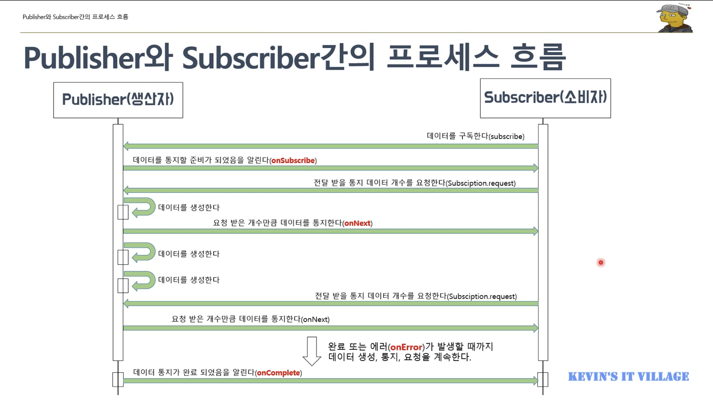
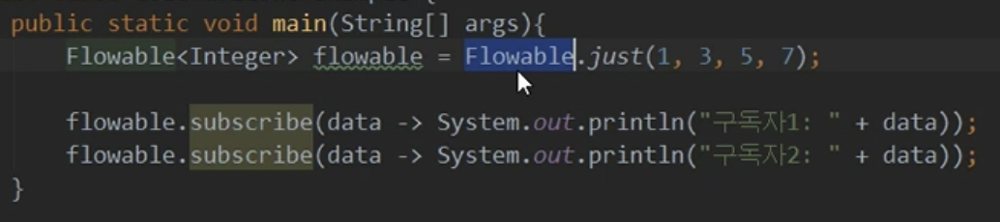
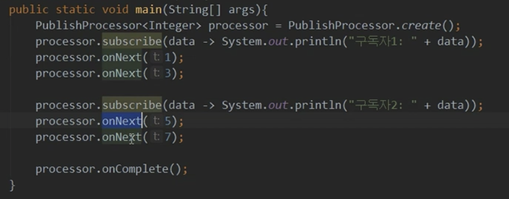

# 12/31 RxJava - Reactive Streams

### Reactive Programming이란?

데이터를 **발행**하고 **가공**하고 **구독**해서 결과를 처리한다.

- 리액티브 개념이 적용된 예
    - Push 방식 : 데이터의 변화가 발생했을 때 변경이 발생한 곳에서 데이터를 보내주는 방식
        
        RTC, Socket Programming, DB Trigger, Spring Application Event, 스마트폰 Push 메세지
        
    - Pull 방식 : 변경된 데이터가 있는지 요청을 보내 질의하고 변경된 데이터를 가져오는 방식
        
        클라이언트 요청 & 서버 응답 방식의 어플리케이션
        
- 리액티브 프로그래밍을 위해 알아야 될 것들
    - Observable : 데이터 소스 (지속적으로 변경이 가능한 데이터)
    - 리액티브 연산자(Operators) : 데이터 소스를 처리하는 함수
    - Scheduler : 쓰레드 관리자
    - Subscriber : Observable이 발행한 데이터를 구독하는 구독자
    - 함수형 프로그래밍 : RxJava에서 제공하는 연산자(Operator) 함수를 사용

```java
public static void main(String[] args) throws InterruptedException {
        Observable.just(100, 200, 300, 400, 500)
                .doOnNext(data -> System.out.println(getThreadName() + " : " + "#doOnNext() : " + data))
                .subscribeOn(Schedulers.io()) // 데이터의 발행, 흐름을 처리할 쓰레드를 결정
                .observeOn(Schedulers.computation()) // 발행된 데이터를 발행하고 구독해서 처리할 쓰레드를 결정
                .filter(number -> number > 300)
                .subscribe(num -> System.out.println(getThreadName() + " : result : " + num));
				// subscribeOn, observeOn = Schduler
        Thread.sleep(500);
    }
```

### Reactive Streams란?

- 리액티브 프로그래밍 라이브러리의 표준 사양
- 리액티브 프로그래밍에 대한 인터페이스만 제공한다
- RxJava는 이 Reactive Streams의 인터페이스들을 구현한 구현체
- Reactive Streams는 Publisher, Subscriber, Subscription, Processor 라는 4개의 인터페이스를 제공한다.
- Publisher : 데이터를 생성하고 통지한다.
    
    ```java
    public interface Publisher<T> {
        public void subscribe(Subscriber<? super T> s);
    }
    ```
    
- Subscriber : 통지된 데이터를 전달 받아서 처리한다.
    
    ```java
    public interface Subscriber<T> {
        public void onSubscribe(Subscription s);
    		// 데이터를 최초 통지할 때
        public void onNext(T t);
    		// 데이터를 통지할 때마다
        public void onError(Throwable t);
    		// 데이터 통지해서 에러가 발생했을 때
        public void onComplete();
    		// 데이터 통지가 끝났을 때
    }
    ```
    
- Subsription : 전달 받을 데이터의 개수를 요청하고 구독을 해지한다.
- Processor : Publisher와 Subscriber의 기능이 모두 있음
- 프로세스
    
    
    
- Cold Publisher
    
    
    
    - 생산자는 소비자가 구독 할 때마다 데이터를 처음부터 새로 통지
    - 데이터를 통지하는 새로운 타임 라인이 생성
    - 소비자는 구독 시점과 상관없이 통지된 데이터를 처음부터 전달 받을 수 있다
- Hot Publisher
    
    
    
    - 생산자는 소비자 수와 상관없이 데이터를 한번만 통지
    - 즉, 데이터를 통지하는 타임라인은 하나
    - 소비자는 발행된 데이터를 처음부터 전달 받는게 아니라 구독한 시점에 통지된 데이터들만 전달 받을 수 있다