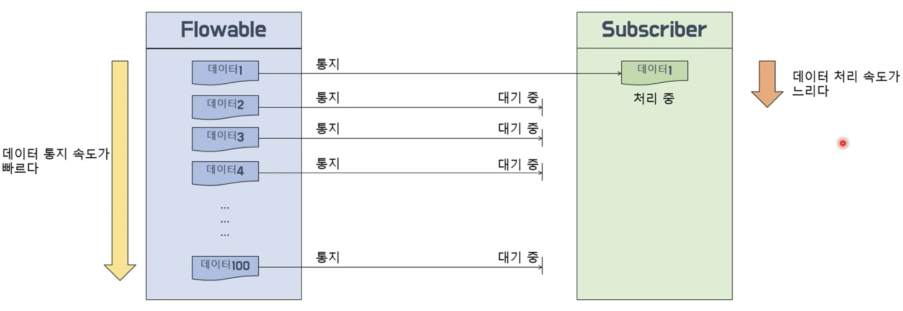

# 1/2 RxJava - Flowable, Observable

### Flowable과 Observable의 차이점

**Flowable**

- Reactive Streams 인터페이스를 구현함
- Subscriber에서 데이터를 처리한다
- 데이터 개수를 제어하는 **배압**기능이 있음
- Subscription으로 전달 받는 데이터 개수를 제어할 수 있다
- Subscription으로 구독을 해지한다

**Observable**

- Reactive Streams 인터페이스를 구현하지 않음
- Observer에서 데이터를 처리한다
- 데이터 개수를 제어하는 **배압**기능이 없음
- 배압기능이 없기 때문에 데이터 개수를 제어할 수 없다
- Disposable로 구독을 해지한다

**배압(Back Pressure)**이란??

= Flowable에서 데이터를 통지하는 속도가 Subsriber에서 통지된 데이터를 전달받아 처리하는 속도보다 빠를 때 밸런스를 맞추기 위해 데이터 통지량을 제어하는 기능을 말한다



**배압전략**

- MISSING 전략
    - 배압을 적용하지 않는다
    - 나중에 onBackpressureXXX()로 배압 적용을 할 수 있다.
- ERROR 전략
    - 통지된 데이터가 버퍼의 크기를 초과하면 MissingBackpressureException 에러를 통지한다.
    - 즉, 소비자가 생산자의 통지 속도를 따라 잡지 못할 때 발생한다.
- BUFFER 전략
    - DROP_LATEST 전략
        - 버퍼가 가득 찬 시점에 버퍼내에서 가장 최근에 버퍼로 들어온 데이터를 DROP한다
        - DROP된 빈 자리에 버퍼 밖에서 대기하던 데이터를 채운다
    
    ```java
    public static void main(String[] args){
        System.out.println("# start : " +TimeUtil.getCurrentTimeFormatted());
        Flowable.interval(300L, TimeUnit.MILLISECONDS)
                .doOnNext(data -> Logger.log("#inverval doOnNext()", data))
                .onBackpressureBuffer(
                        2,
                        () -> Logger.log("overflow!"),
                        BackpressureOverflowStrategy.DROP_LATEST)
                .doOnNext(data -> Logger.log("#onBackpressureBuffer doOnNext()", data))
                .observeOn(Schedulers.computation(), false, 1)
                .subscribe(
                        data -> {
                            TimeUtil.sleep(1000L);
                            Logger.log(LogType.ON_NEXT, data);
                        },
                        error -> Logger.log(LogType.ON_ERROR, error)
                );
    
        TimeUtil.sleep(2800L);
    }
    ```
    
    - DROP_OLDEST 전략
        - 버퍼가 가득 찬 시점에 버퍼내에서 가장 오래전에 버퍼로 들어온 데이터를 DROP한다
        - DROP된 빈 자리에는 버퍼 밖에서 대기하던 데이터를 채운다
    
    ```java
    public static void main(String[] args){
    	  System.out.println("# start : " +TimeUtil.getCurrentTimeFormatted());
    	  Flowable.interval(300L, TimeUnit.MILLISECONDS)
    	          .doOnNext(data -> Logger.log("#inverval doOnNext()", data))
    	          .onBackpressureBuffer(
    	                  2,
    	                  () -> Logger.log("overflow!"),
    	                  BackpressureOverflowStrategy.DROP_OLDEST)
    	          .doOnNext(data -> Logger.log("#onBackpressureBuffer doOnNext()", data))
    	          .observeOn(Schedulers.computation(), false, 1)
    	          .subscribe(
    	                  data -> {
    	                      TimeUtil.sleep(1000L);
    	                      Logger.log(LogType.ON_NEXT, data);
    	                  },
    	                  error -> Logger.log(LogType.ON_ERROR, error)
    	          );
    	
    	  TimeUtil.sleep(2500L);
    	}
    ```
    
- DROP 전략
    - 버퍼에 데이터가 모두 채워진 상태가 되면 이후에 생성되는 데이터를 버리고(DROP), 버퍼가 비워지는 시점에 DROP되지 않은 데이터부터 다시 버퍼에 담는다
    
    ```java
    public static void main(String[] args){
        Flowable.interval(300L, TimeUnit.MILLISECONDS)
                .doOnNext(data -> Logger.log("#inverval doOnNext()", data))
                .onBackpressureDrop(dropData -> Logger.log(LogType.PRINT, dropData + " Drop!"))
                .observeOn(Schedulers.computation(), false, 1)
                .subscribe(
                        data -> {
                            TimeUtil.sleep(1000L);
                            Logger.log(LogType.ON_NEXT, data);
                        },
                        error -> Logger.log(LogType.ON_ERROR, error)
                );
    
        TimeUtil.sleep(5500L);
    }
    ```