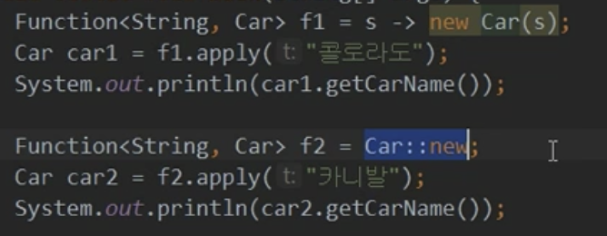
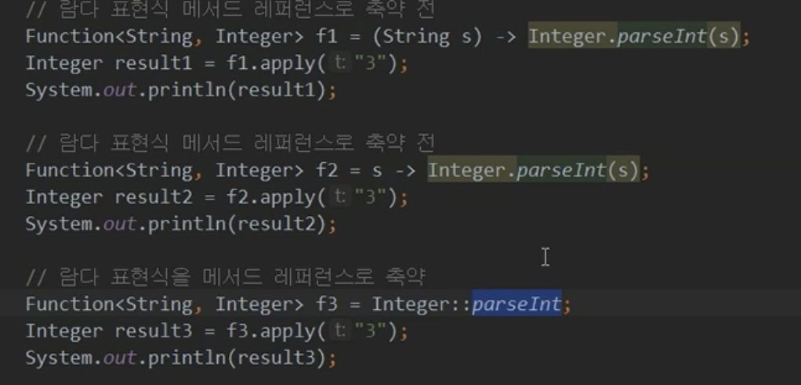
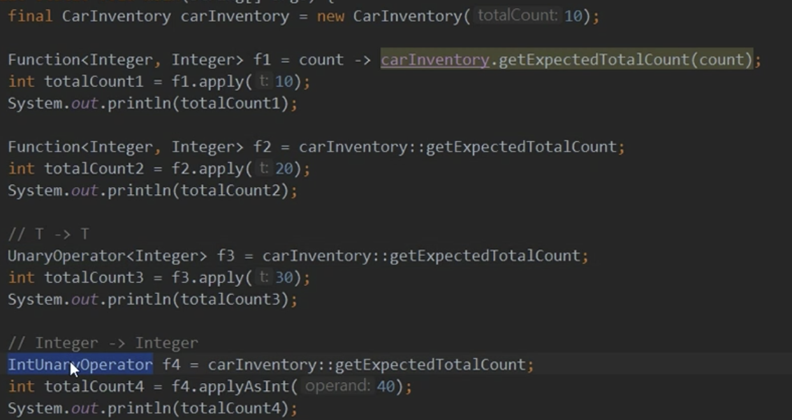

# 1/3 RxJava - 함수형 인터페이스와 람다

### 함수형 인터페이스

- 말 그대로 Java의 interface
- 단 하나의 추상 메서드만 가지고 있는 인터페이스이다.
- 람다 표현식으로 작성해서 다른 메서드의 파라미터로 전달할 수 있다.
- 람다 표현식 전체를 해당 **함수형 인터페이스를 구현한 클래스의 인스턴스로 취급한다**

### 람다 표현식

- 람다 표현식은 함수형 인터페이스를 구현한 클래스 즉, 익명 클래스의 메서드를 단순화 한 표현식이다.
- 함수형 인터페이스의 메서드를 람다 표현식으로 작성해서 다른 메서드의 파라미터로 전달 할 수 있다
- 즉, 람다 표현식 전체를 해당 함수형 인터페이스를 구현한 클래스의 인스턴스로 취급한다.]

** Predicate = 1개의 메소드를 구현했을 때 반환값이 boolean인 인터페이스

### 함수 디스크립터

- 함수형 인터페이스의 추상 메서드를 설명해놓은 시그니처를 함수 디스크립터라고 한다.
- Java 8에서는 java.util.function 패키지로 다양한 새로운 함수형 인터페이스를 지원한다
- Predicate<t> == T → boolean
- Consumer<t> == T → void
- Function<T,R> == T → R
- BiPredicate<L,R> == (L, R) → boolean
- BiConsumer<T, U> == (T,U) → void
- BiFunction<T, U, R> == (T,U) → R

### 메서드 레퍼런스

- 메서드 참조
- 람다 표현식 body 부분에 기술되는 메서드를 이용해서 표현되며, 메서드의 이름만 전달한다
- 구분자(::)를 붙이는 방식으로 메서드 레퍼런스를 표현한다
- 메서드 레퍼런스를 사용하면 람다 표현식이 더욱 간결해진다

### 메서드 레퍼런스의 유형

- ClassName::static mathod
    
    ex ) (String s) → Integer.parseInt(s)
    
    = Integer::parseInt
    

- ClassName::instance method
    
    ex ) (String s) → s.toLowerCase()
    
    = String::toLowerCase (파라미터 타입이 예상 가능하므로 축약 가능)
    

- object::instance method
    
    ex ) (int count) → obj.getTotal(count)
    
    = obj::getTotal
    

- ClassName::new
    
    ex ) () → new Car()
    
    = Car::new
    

---