# 1/5 RxJava - 데이터 변환 연산자

### Map

- 원본 Observble에서 통지하는 데이터를 원한느 값으로 변환 후 통지한다
- 변환 전, 후 데이터 타입은 달라도 상관없다
- **null을 반환하면 NullPointerException이 발생하므로 null이 아닌 데이터 하나를 반드시 반환해야 한다.**

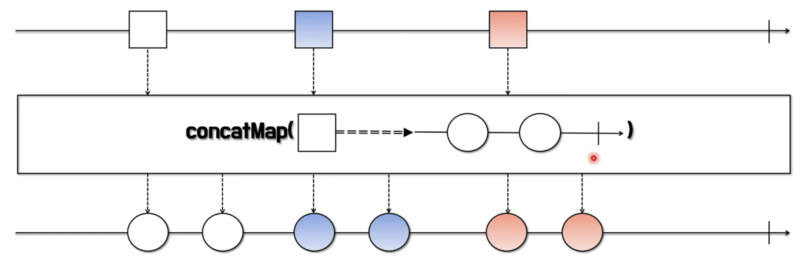

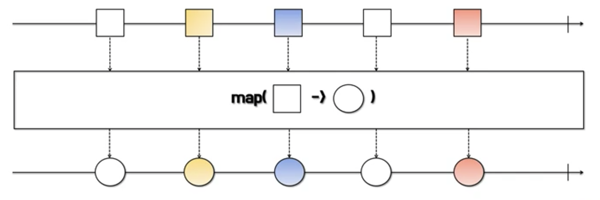

### flatMap

- 원본 데이터를 원하는 값으로 변환한 후 통지하는 것은 map과 같다
- map이 1대 1변환인 것과 달리 flatMap은 1대 다 변환으로 데이터 한개로 여러 데이터를 통지할 수 있다
- map은 변환된 데이터를 반환하지만 flatMap은 변환된 여러개의 데이터를 담고 있는 새로운 Observable을 반환한다.

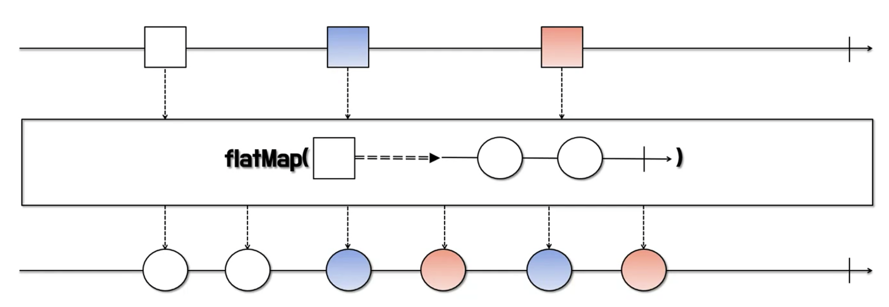

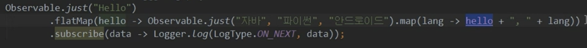

- 구구단 만들기

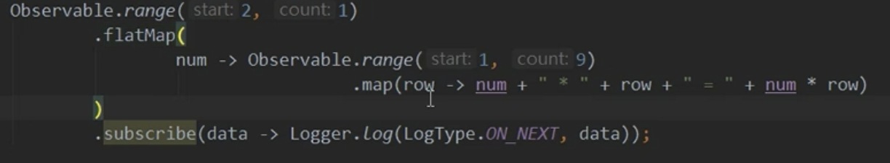

- 원본 데이터와 변환된 데이터를 조합해서 새로운 데이터를 통지한다.
- 즉 Observable에 원본 데이터 + 변환된 데이터 = 최종 데이터 (parameter가 두개)

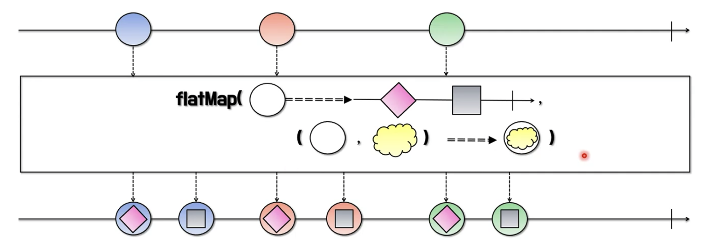

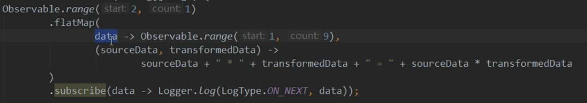

### concatMap

- flatMap과 마찬가지로 받은 데이터를 변환하여 새로운 Observable로 반환한다.
- 반환된 새로운 Observable을 **하나씩 순서대로 실행하는 것이 FlatMap과 다르다**
- 즉, 데이터의 처리 순서는 보장하지만 처리중인 Observable의 처리가 끝나야 다음 Observable이 실행되므로 처리 **성능에는 영향을 줄 수 있다**

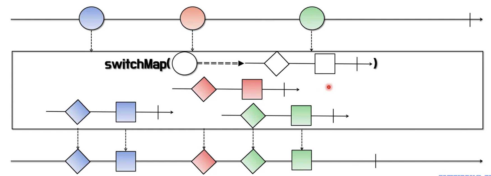

### switchMap

- concatMap과 마찬가지로 받은 데이터로 변환하여 새로운 Observable로 변환한다
- concatMap과 다른점은 switchMap은 순서를 보장하지만 새로운 데이터가 통지되면 현재 처리중이던 작업을 바로 중단한다

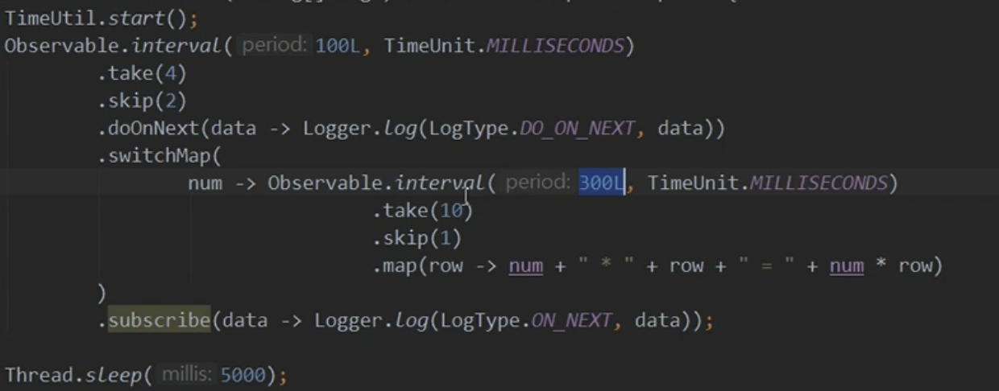

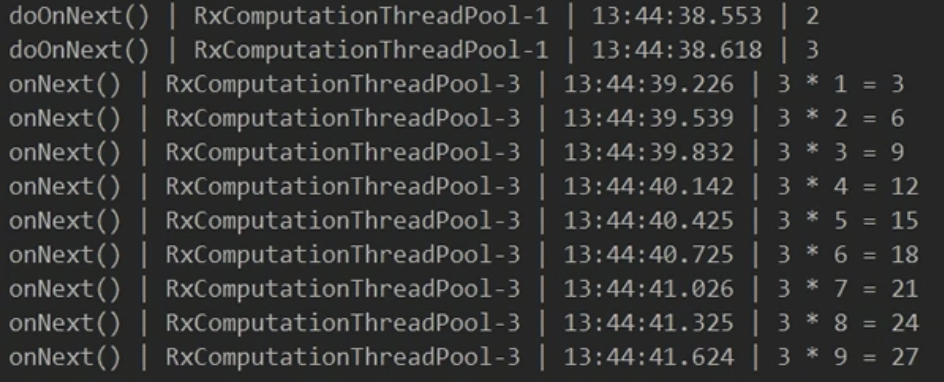

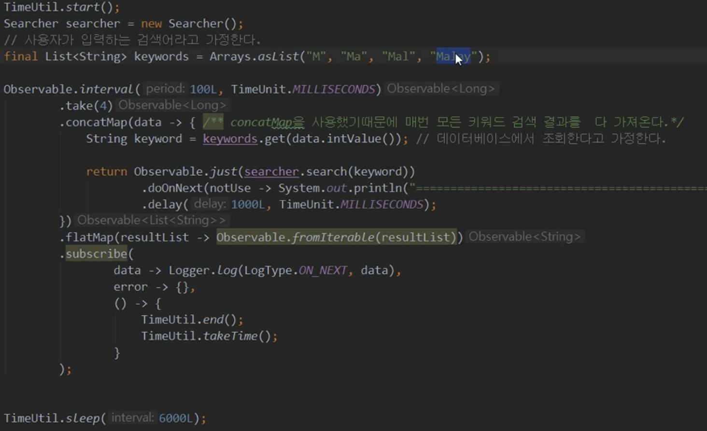

** 2단이 출력되기 전에 3이 들어와서 2단은 출력되지 않고 3단만 출력이 된다

** 예를 들어 사용자가 키보드로 검색을 할 경우 이전의 찾아보던 로직은 중단하는..

concatMap 사용시

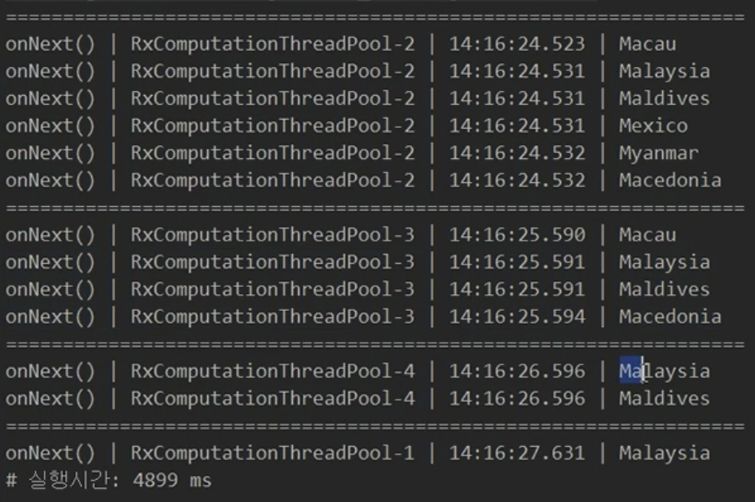

결과

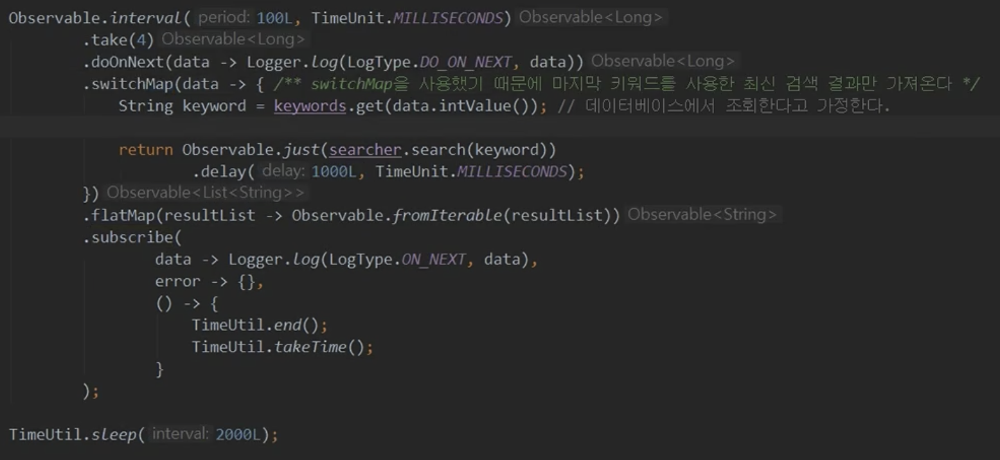

switchMap 사용시

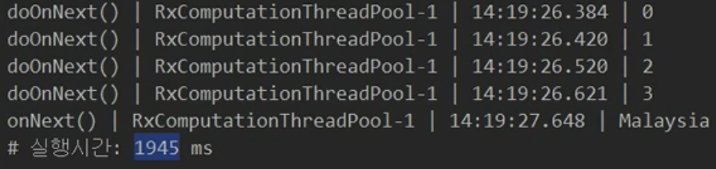

결과

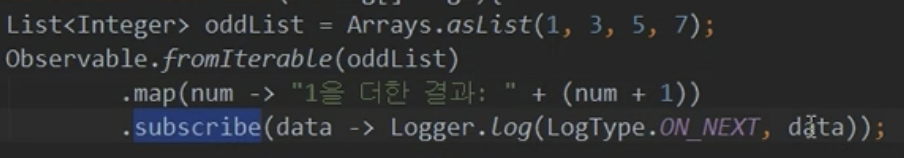