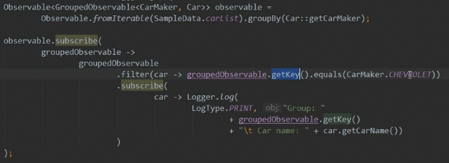
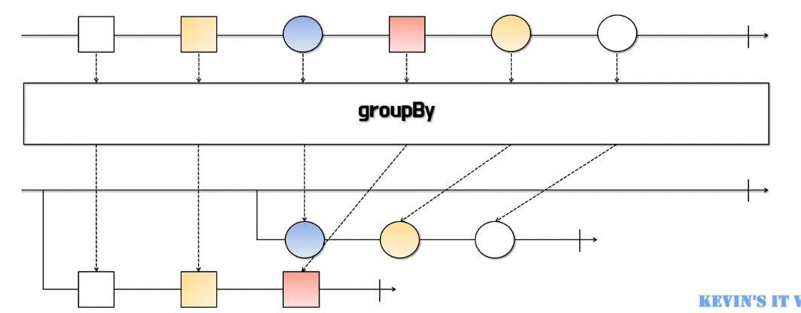
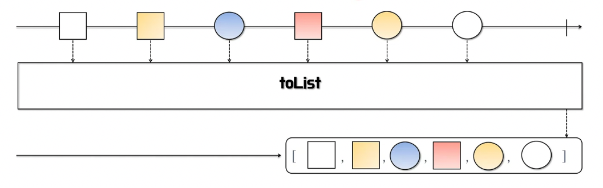
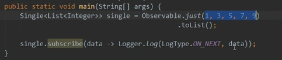
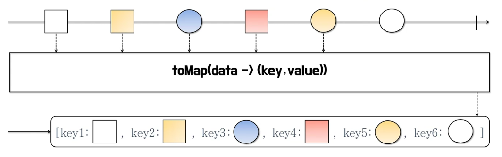
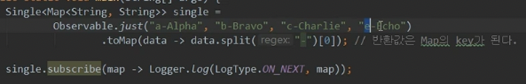
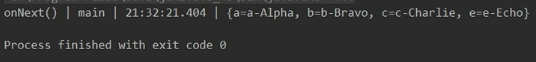
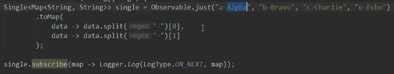
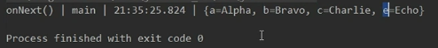

# 1/6 Spring Boot, RxJava - Operators

### Spring Boot

- 엔터프라이즈급 어플리케이션을 빠르게 만드는데 도와준다
- 사용자가 원한다면 쉽게 Default 설정에 대한 수정이 가능하다
- XML에 의존하지 않는다

 ** 파라미터 작성시 가변인자가 뒤로

** SpringApplication.class 에서부터 컴포넌트 스캔이 이뤄지기 때문에 디렉토리 댑스 조심!

** pom.xml에 parent pom을 확인해보면 기본적인 설정들을 확인할 수 있다

### 자동 설정 개요

- @EnableAutoConfiguration - @SpringBootApplication 안에 숨어 있음
- 빈은 사실 두 단계로 나눠서 읽힘
    - 1단계 : @ComponentScan
    - 2단계 : @EnableAutoConfiguration

---

### 데이터 변환 연산자

**groupBy**

- 하나의 Observable을 여러개의 새로운 GroupedByObservable로 만든다
- 원본 Observable의 데이터를 그룹별로 묶는다기보다는 각각의 데이터들이 그룹에 해당하는 Key를 가지게 된다
- GroupedByObservable은 getKey()를 통해 구분된 그룹을 알 수 있게 해준다

**toList**

- 통지 되는 데이터를 모두 List에 담아 통지한다.
- 원본 Observable 에서 완료 통지를 받는 즉시 리스트를 통지한다
- 통지되는 데이터는 원본 데이터를 담은 리스트 하나이므로 Single로 반환된다

**toMap**

- 통지 되는 데이터를 모두 Map에 받아 통지한다.
- 원본 Observable에서 완료 통지를 받는 즉시 Map으로 통지한다
- 이미 사용중인 Key(키)와 value(값)를 덮어쓴다
- 통지되는 데이터는 원본 데이터를 담은 Map 하나이므로 Single로 반환된다

