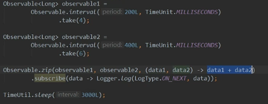
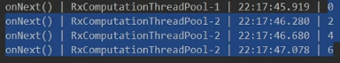
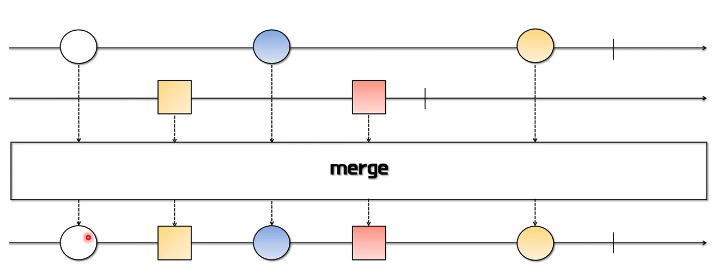
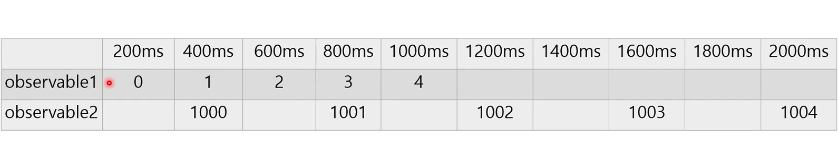
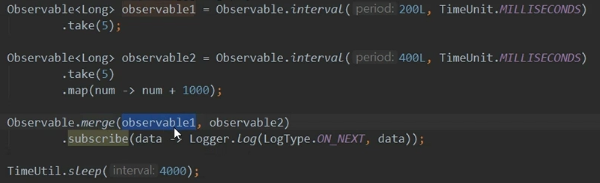
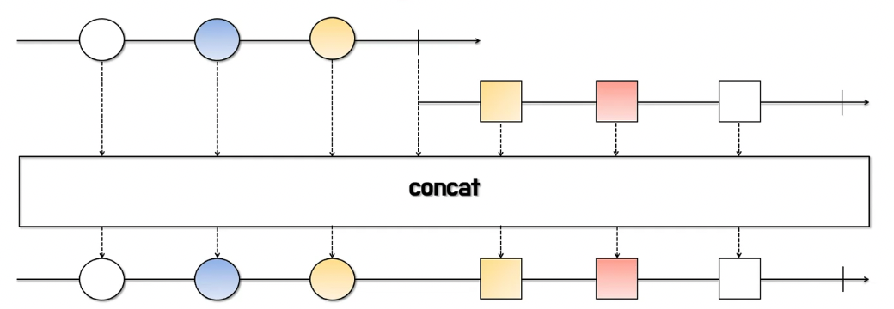
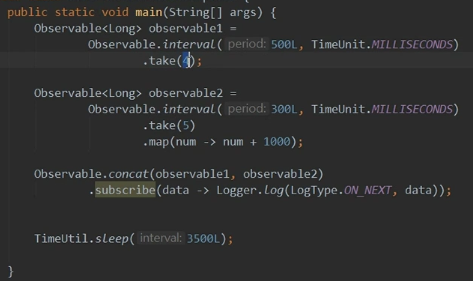
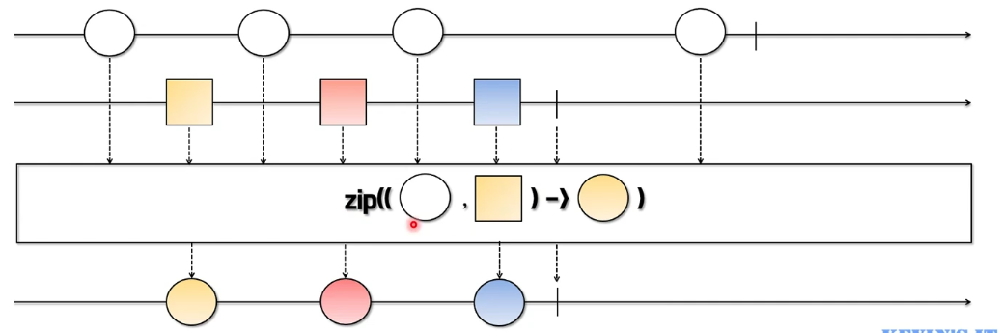

# 1/7 RxJava - Operators - 결합연산자

### 결합 연산자

**merge**

- 다수의 Observable에서 통지된 데이터를 받아서 다시 하나의 Observable로 통지한다
- 통지 시점이 빠른 Observable의 데이터부터 순차적으로 통지되고 통지 시점이 같을 경우에는 merge()함수의 파라미터로 먼저 지정된 Observable 데이터부터 통지된다.

**concat**

- 다수의 Observable에서 통지된 데이터를 받아서 다시 하나의 Observable로 통지한다.
- 하나의 Observable에서 통지가 끝나면 다음 Observable에서 연이어 통지가 된다.
- 각 Observable의 통지 시점과는 상관없이 concat() 함수의 파라미터로 먼저 입력된 Observable의 데이터부터 모두 통지된 후, 다음 Observable의 데이터가 통지된다.

**zip**

- 다수의 Observable에서 통지된 데이터를 받아서 다시 하나의 Observable로 통지한다.
- 각 Observable에서 통지된 데이터가 모두 모이면 각 Observable에서 동일한 index의 데이터로 새로운 데이터를 생성한 후 통지한다.
- 통지하는 데이터 개수가 가장 적은 Observable의 통지 시점에 완료 통지 시점을 맞춘다.
    
    : 갯수가 맞지 않는 경우 반환하지 않는다
    

