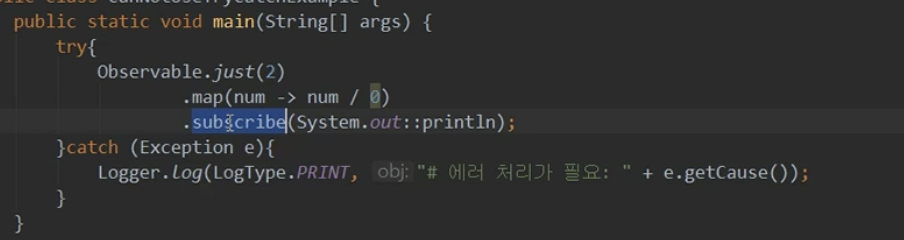
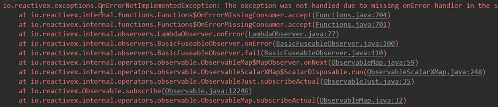
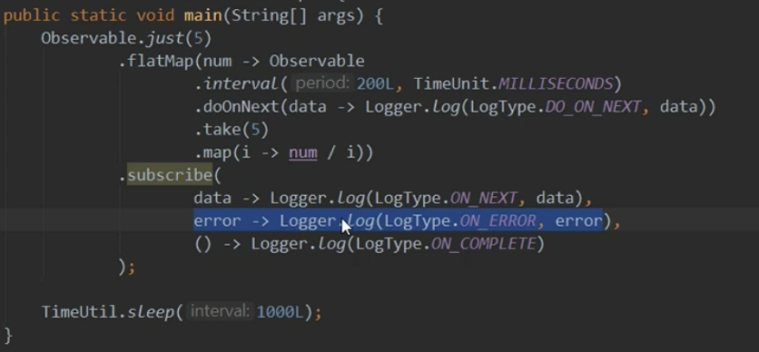
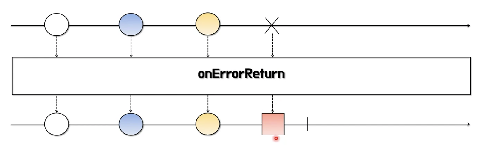
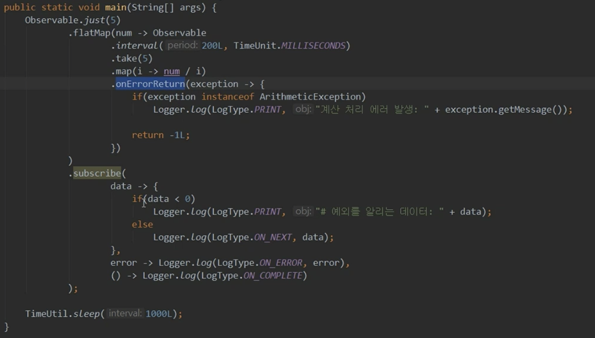
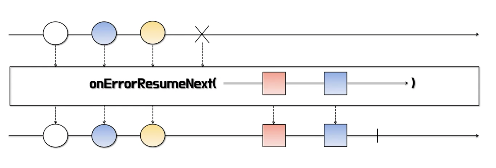
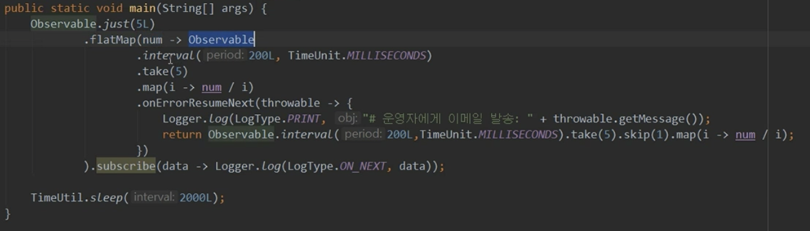
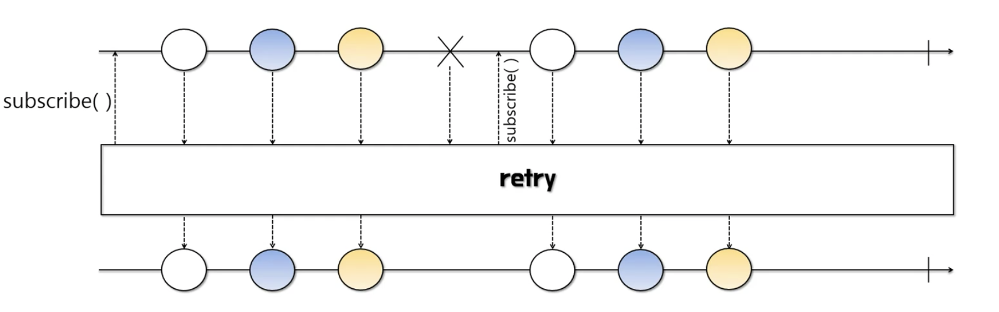

# 1/8 RxJava - Errror 연산자

** Reactive API를 사용하는 경우 Try Catch 구문으로 묶어도 에러를 잡지 못한다. **

→ 그러므로 error 처리 연산자를 통해 해결해준다

**onErrorReturn**

- 에러가 발생했을 때 에러를 의미하는 데이터로 대체할 수 있다
- onError 이벤트를 발생시키지 않는다

**onErrorResumeNext**

- 에러가 발생했을 때 에러가 의미하는 Observable로 대체할 수 있다
- Observable로 대체할 수 있으므로 데이터 교체와 더불어 에러 처리를 위한 추가 작업을 할 수 있다

**retry**

- 데이터 통지 중 에러가 발생했을 때, 데이터 통지를 재시도한다
- 즉, onError 이벤트가 발생하면 subscribe() 를 다시 호출하여 재구독한다

!! 에러가 발생한 시점의 데이터만 재호출하는 것이 아닌 처음부터 다시 불러온다