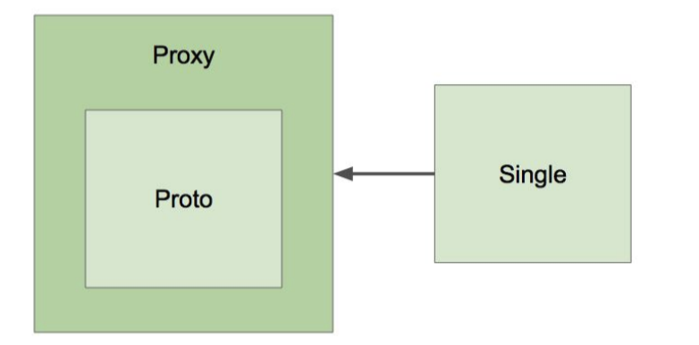
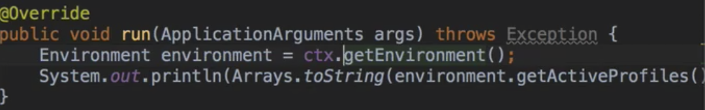

# 12/29 IoC Container

### @Autowired

- required : 기본값은 true → 찾지 못하면 애플리케이션 구동 실패
- 사용가능 위치
    - 생성자
    - 세터 - required false 가능
    - 필드 - required false 가능
- 중복 타입의 빈이 여러개인 경우
    - 원하는 클래스에 @Primary를 달아준다
    - 원하는 클래스의 이름을 @Qualifier에 넣어줌 - default = 클래스명
- 동작원리
    - BeanPostProcessor - 새로 만든 빈 인스턴스를 수정할 수 있는 라이프 사이클 인터페이스
    - AutowiredAnnotationBeanPostProcesor extends BeanPostProcessor
      
        스프링이 제공하는 Autowired, Value, Inject 어노테이션 처리
        

### @Component, @ComponentScan

- 컴포넌트 스캔 주요 기능
    - 스캔 시작 위치 설정
    - @Filter : 어떤 어노테이션을 스캔할지 스캔하지 않을지
- @Component
    - @Repository
    - @Service
    - @Controller
    - @Configuration
- 동작원리
    - @ComponentScan은 스캔할 패키지와 어노테이션에 대한 정보
    - 실제 스캐닝은 ConfigurationClassPostProcessor라는 BeanFactoryPostProcessor에 의해 처리됨
    - Funtional을 이용한 빈등록 방법이 있지만 추천하지 않음 - 일일히 다 넣어줘야 하기 때문에

### 빈의 스코프

- 스코프
    - 싱글톤 - 대부분의 경우 사용되는 하나의 객체만 사용
    - 프로토타입 - 객체를 사용할 때마다 새로 생성
        - Request
        - Session
        - WebSocket
- 프로토타입 빈이 싱글톤 빈을 참조하는 경우 - No Problem
- 싱글톤 빈이 프로토타입 빈을 참조하는 경우 - 프로토타입 빈이 업데이트가 안 됨
    - 업데이트를 하려면
        - scoped-proxy
        - Object-Provider
        - Provider
    
    ** 자바 기반의 프록시 생성 라이브러리는 인터페이스 기반
    
    ** CGLib 기반의 프록시의 경우는 클래스도 가능
    
    
    
    싱글톤 객체 사용시 주의점
    
    - 프로퍼티가 공유되므로 멀티 쓰레드 고려
    - ApplicationContext 초기 구동시 인스턴스 생성

### Environment - Profile

프로파일과 프로퍼티를 다루는 인터페이스

- ApplicationContext extends EnvironmentCapable
    - getEnvironment()
      
        
    
- 프로파일
    - 빈들의 그룹
    - Environment의 역할은 활성화할 프로파일 확인 및 설정
- 프로파일 유즈 케이스
    - 테스트 환경에서는 A라는 빈을 사용하고, 배포환경에서는 B라는 빈을 쓰고 싶다.
    - 이 빈은 모니터링 용도니까 테스트할 때는 필요가 없고 배포할 때만 등록이 되면 좋겠다.
- 프로파일 정의하기
    - 클래스에 정의 - @Configuration @Profile(”test”)
    - 메소드에 정의 - @Bean @Profile(”test”)
    - @Profile(”!test”) : test가 아닌 경우 - ! & | 이 세가지 키워드가 가능하다