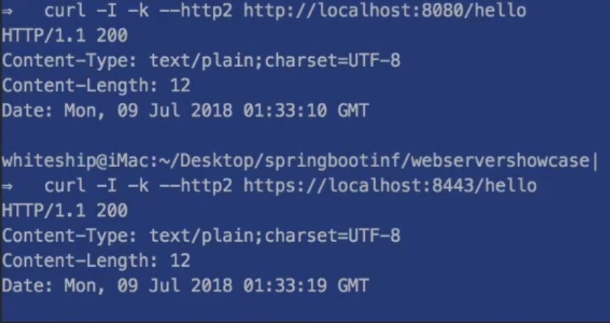

# 1/13 Spring Boot - HTTPS, HTTP2

**HTTPS 사용하기**

- 원하는 키를 발급한 뒤 Properties 파일에 등록해준다

```xml
// application properties

server.ssl.key-store=keystore.p12 // 경로를 넣어줄 수 있다 classpath:... 이런식으로
server.ssl.key-store-type=PKCS12 // 키의 종류
server.ssl.key-store-password=123456
server.ssl.key-alias=spring
```

- HTTPS 사용을 하게 되는 경우 Connector가 하나이기 때문에 더이상 HTTP를 사용할 수 없다
- HTTP도 사용하기 위해서 커넥터를 새로 생성해준다

```xml
		@Bean
    public ServletWebServerFactory serverFactory(){
        TomcatServletWebServerFactory tomcat = new TomcatServletWebServerFactory();
        tomcat.addAdditionalTomcatConnectors(createStandardConnector());
        return tomcat;
    }

    private Connector createStandardConnector(){
        Connector connector = new Connector("org.apache.coyote.http11.Http11NioProtocol");
        connector.setPort(8080);
        return connector;
    }
```



**HTTP2 사용하기**

** HTTP/2란 HTTP/1.1과 다른걸까? → 아니다 기존의 프로토콜을 성능을 집중적으로 개선한 것

- properties에서 server.http2.enabled=true 를 설정해준다
- underTow의 경우 별다른 추가 설정 없이 HTTP2 사용이 가능하다
- tomcat의 경우 버젼 9.0.x JDK9 이상의 설정부터 별다른 설정 없이 사용이 가능하지만 이전 버젼에서는 설정해줘야 할 사항이 많으므로 권장이 되지 않는다
- 톰캣 버젼 설정

```xml
// pom.xml
<properties>
    <java.version>1.9</java.version>
    <tomcat.version>9.0.10</tomcat.version>
</properties>
```