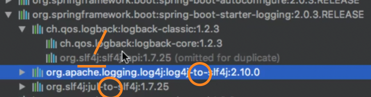

# 1/17 Spring Boot 외부설정, 로깅

### 외부 설정

- Relaxed Binding
    - Casing 에 상관없이 지정된 프로퍼티 값을 가져온다
    - jackson-name
    - jackson_name
    - jacksonName
    - JACKSONNAME
- 프로퍼티 타입 컨버전
    - @DurationUnit ← 날짜나 시간값으로 변경해주는 어노테이션
- 프로퍼티 값 검증
    - @Validated ← 프로퍼티 클래스 필드에 Validation을 추가하여 구동시 확인
- @Value
    - SpEL은 사용가능
    - 위 기능은 전부 사용 불가

**프로파일**

- 프로파일 active를 하는 시점은 jar 파일 구동시 command line variable로 주는게 안정적이다 (우선순위)
- default properties에서 spring.profiles.include 라는 설정값을 통해 다른 properties 파일이 함께 읽히도록 할 수 있다

### 로깅

- 로깅 퍼사드 : **Commons Logging**, SLF4j ← 로거를 추상화하여 편의성 ⬆️ , 로거를 바꿔 낄 수 있다
- 로거 : JUL, Log4J2, **Logback**
- 스프링 5에서는 Exclusion을 시켜야하는 불편함을 해결하고자
    - Commons Logging → SLF4j → Logback (최종적으로 Logback)
        
        
        
- 스프링 부트 로깅
    - 기본 포맷
    - —debug (일부 핵심 라이브러리만 디버깅 모드로)
    - —trace (전부 다 디버깅 모드로)
    - 컬러 출력 : spring.output.ansi.enabled=always
    - 파일 출력 : logging.file 또는 loggin.path 선택
    - 로그 레벨 조정 : logging.level 패키지 = 로그 레벨
        
        ex ) logging.level.me.jackson=debug (패키지별 로그 레벨 설정)
        
    - 커스텀 로그 설정 파일 사용하기
        - Logback : logback-spring.xml
        - Log4j2 : log4j2-spring.xml
        - JUL (비추) : logging.properties
        - Logback extension
            - 프로파일 <springProfile name=”dev”>
            - Environment 프로퍼티 <springProperty>