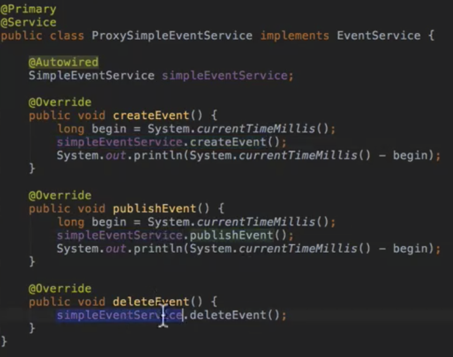

# 1/5 Spring AOP

### 스프링 AOP

특징

- 프록시 기반의 AOP 구현체
- 스프링 빈에만 AOP를 적용할 수 있다
- 모든 AOP기능을 제공하는 것이 목적이 아니라, 스프링 IoC와 연동하여 엔터프라이즈 어플리케이션에서 가장 흔한 문제에 대한 해결책을 제공하는 것이 목적

프록시 패턴

- 왜? 기존 코드 변경 없이 접근 제어 또는 부가 기능 추가

- 기존 코드를 건드리지 않고 성능 측정하기

문제점

- 매번 프록시 클래스를 작성해야 하는가?
- 여러 클래스 여러 메소드에 적용하려면?
- 객체들 관계도 복잡..

그래서 등장한 것이 Spring AOP

- 스프링 IoC 컨테이너가 제공하는 기반 시설과 Dynamic 프록시를 사용하여 여러 복잡한 문제를 해결
- 동적 프록시 : 동적으로 프록시 객체 생성하는 방법
    - 자바가 제공하는 방법은 인터페이스 기반 프록시 생성
    - CGlib은 클래스 기반 프록시도 지원
- 스프링 IoC : 기존 빈을 대체하는 동적 프록시 빈을 만들어 등록 시켜준다
    - 클라이언트 코드 변경 없음
    - **AbstractAutoProxyCreator implements BeanPostProcessor**
        
        : 동적으로 스프링 프록시 객체를 만들어주는 클래스
        

### 스프링 AOP

Aspect 정의

- @Aspect
- 빈으로 등록해야 하니까 (컴포넌트 스캔을 사용한다면) @Component도 추가

포인트컷 정의

- @PointCut(표현식)
- 주요 표현식
    - execution
    - @Annotation
    - bean
- 포인트컷 조합
    - &&, ||, !
- 어드바이스 정의
    - @Before
    - @AfterReturning
    - @AfterThrowing
    - @Around

### Null-safety

스프링 프레임워크 5에 추가된 Null 관련 어노테이션 - 인텔리제이 설정에서 넣어줘야함

- @NotNull
- @Nullable
- @NonNullApi(패키지 레벨 설정)
- @NonNullFields(패키지 레벨 설정)

목적

- 툴의 지원을 받아 컴파일 시점에 최대한 NullPointerException을 방지하는 것