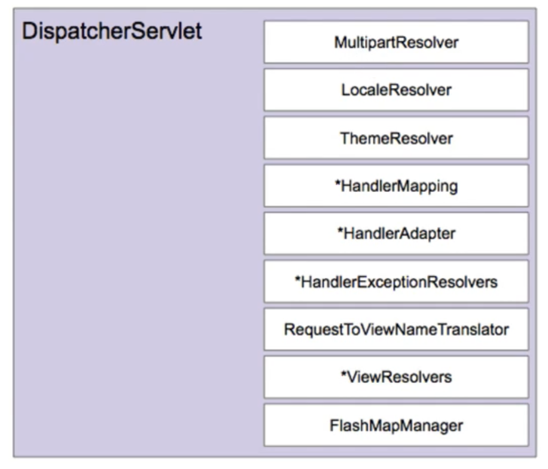

# 4/22 Spring MVC - 구성요소

Date: April 22, 2022 5:30 AM



** *이 붙은 클래스는 복수의 클래스가 존재

DispatcherServlet의 기본 전략

- DispatcherServlet.properties

MultipartResolver

- 파일 업로드 요청 처리에 필요한 인터페이스
- HttpServletRequest를 MultipartHttpServletRequest로 변환해주어 요청이 담고 있는 File을 꺼낼 수 있는 API 제공

LocaleResolver

- 클라이언트의 위치(Locale) 정보를 파악하는 인터페이스
- 기본 전략을 요청의 accept-languag를 보고 판단.

ThemeResolver

- 애플리케이션에 설정된 테마를 파악하고 변경할 수 있는 인터페이스

HandlerMapping

- 요청을 처리할 핸들러를 찾는 인터페이스
- 기본 HandlerMapping
    - RequestMappingHandlerMapping - 어노테이션 기반
    - BeanNameUrlHandlerMapping - 빈 이름 기반으로 요청에 해당하는 class bean을 찾아옴

HandlerAdaptoer

- HandlerMapping이 찾아낸 핸들러를 처리하는 인터페이스
- Spring MVC 확장력의 핵심

HandlerExceptionResolver

- 요청 처리 중 발생한 에러 처리하는 인터페이스

RequestToViewNameTranslator

- 핸들러에서 뷰 이름을 명시적으로 리턴하지 않은 경우, 요청을 기반으로 뷰 이름을 판단하는 인터페이스
- return이 void더라도 요청이 /sample 인 경우 /sample에 해당하는 view 파일을 리턴

ViewResolver

- 뷰 이름에 해당하는 뷰를 찾아내는 인터페이스

FlashMapManager

- FlashMap 인스턴스를 가져오고 저장하는 인터페이스
- FlashMap은 주로 리다이렉션을 사용할 때 요청 매개변수를 사용하지 않고 데이터를 전달하고 정리할 때 사용한다.

### 동작원리

DispatcherServlet 초기화

1. 특정 타입에 해당하는 빈을 찾는다
2. 없으면 기본 전략을 사용한다(DispatcherServlet.properties)

스프링 부트 사용하지 않는 스프링 MVC

- 서블릿 컨테이너에 등록한 웹 애플리케이션에 DispatcherServlet을 등록한다
    - web.xml에 서블릿 등록
    - 또는 WebApplicationInitializer에 자바 코드로 서블릿 등록
    
    ```java
    public class WebApplication implments WebApplicationInitializer {
    	@Override
    	public void onStartup(ServletContext servletContext) throws ServletException {
    		AnnotationConfigWebApplicationContext context = new AnnocationConfigWebApplicationContext();
    		context.register(WebConfig.class);
    		context.refresh();
    		
    		DispatcherSrvlet dispatcherServlet = new DispatcherServlet(context);
    		ServletRegistration.Dynamaic app = servletContxt.addServlet("app", dispatcherServlet);
    		app.addMapping("/app/*");
    	}
    }
    ```